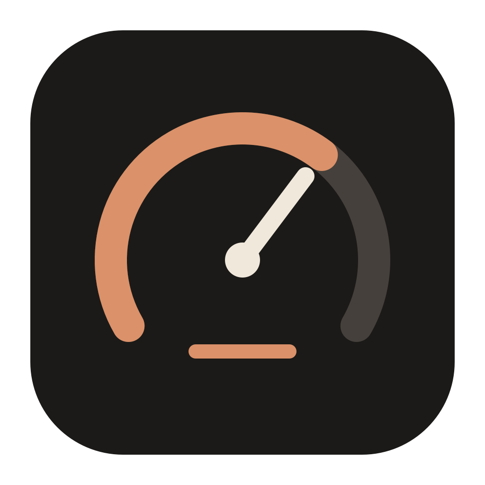
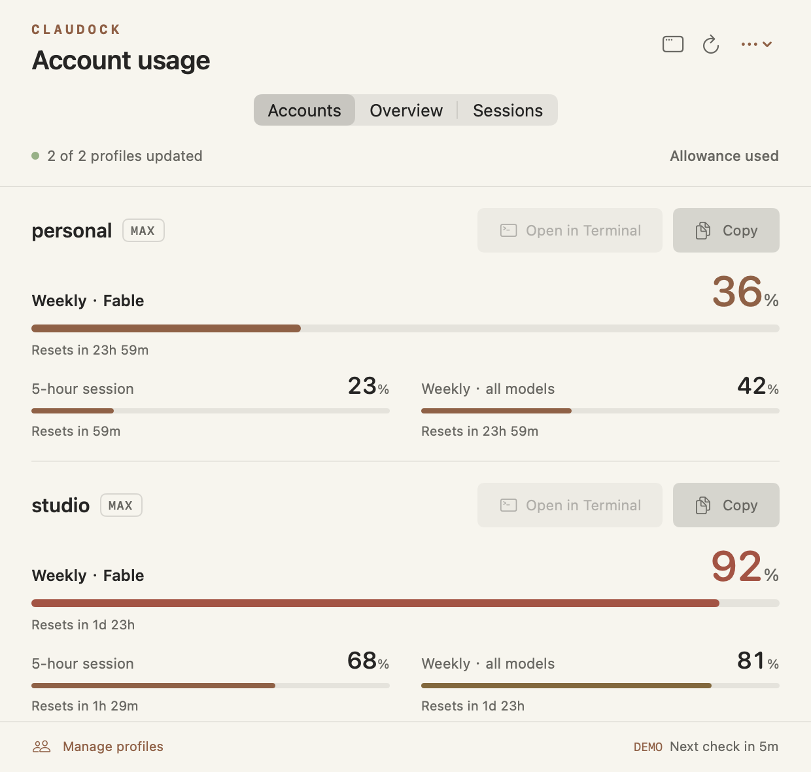
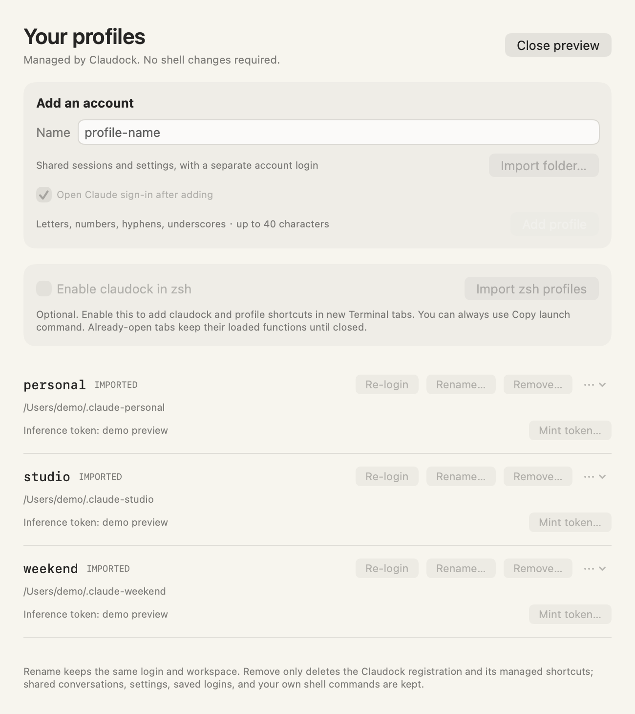
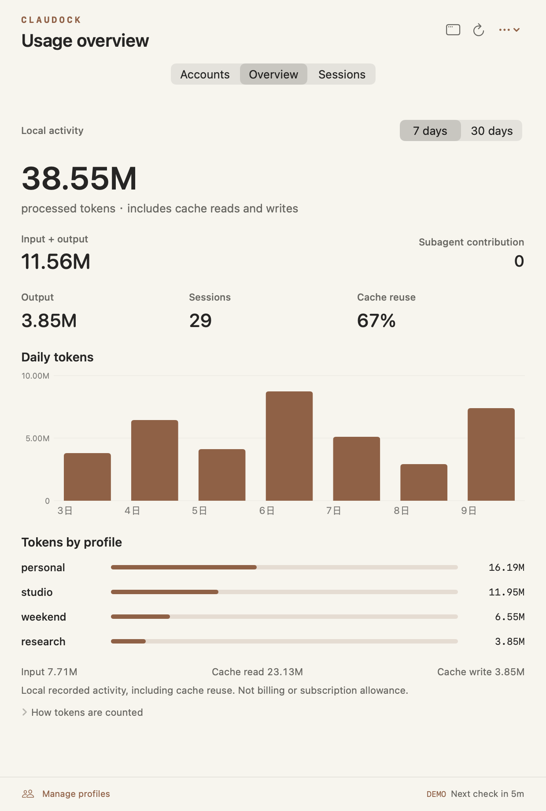
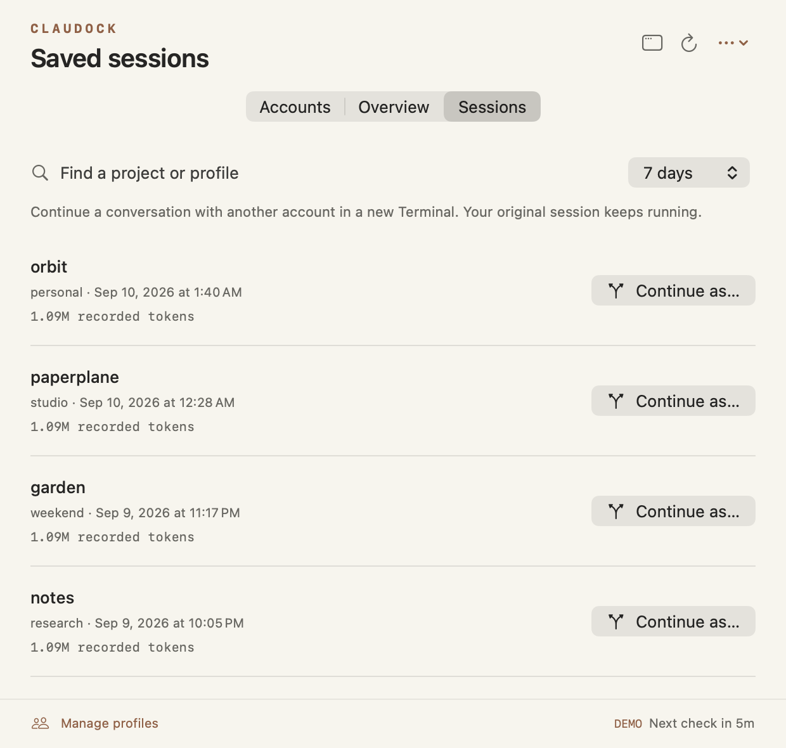
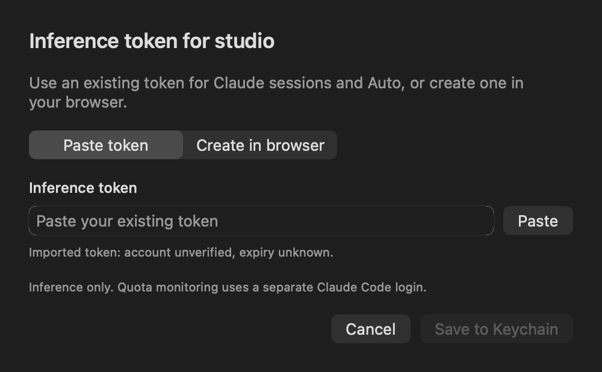

# Claudock

**Your Claude accounts, one menu bar.** See Fable headroom, keep long-lived tokens in Keychain, and let Auto switch accounts when a quota runs out.

[Download preview](https://github.com/luisleo526/claudock/releases/download/v1.5.2/Claudock-1.5.2-macOS-arm64.dmg) · [User guide](docs/GUIDE.md)

> **v1.5.2 preview** for **Apple Silicon**, **macOS 14+**. Ad-hoc signed and **not Apple-notarized**. No Xcode needed to run the app.

<picture>
  <source media="(prefers-color-scheme: dark)" srcset="docs/screenshots/accounts.png">
  
</picture>

*All screenshots show synthetic demo profiles. Percentages show allowance used.*

## Get started

1. Open the downloaded DMG and drag **Claudock.app** to **Applications**.
2. Open Claudock from Applications. If macOS blocks this preview, follow [Apple's instructions for opening an unnotarized app](https://support.apple.com/en-us/102445). After attempting to open it, the approval is under **System Settings → Privacy & Security → Open Anyway**.
3. Click the menu bar icon. Import your existing profiles, or open **Manage profiles** to add an account and sign in.

[Claude Code](https://code.claude.com/docs/en/setup) is needed for sign-in and Terminal actions. Existing `claude-work` and `claude-personal` wrappers can be imported without executing your shell startup files.

Click elsewhere to dismiss the popover. Open the regular dashboard window when you want more room; closing it leaves the menu bar app running.

Also available: [ZIP archive](https://github.com/luisleo526/claudock/releases/download/v1.5.2/Claudock-1.5.2-macOS-arm64.zip) and [SHA256 checksums](https://github.com/luisleo526/claudock/releases/download/v1.5.2/Claudock-1.5.2-SHA256SUMS.txt). See the [release notes](https://github.com/luisleo526/claudock/releases/tag/v1.5.2).

<details>
<summary>Build from source</summary>

Building requires **full Xcode 16 or newer**. Open Xcode once to finish setup, then run:

```sh
git clone https://github.com/luisleo526/claudock.git
cd claudock
./scripts/bootstrap.sh
```

You can also double-click **Bootstrap.command** in the source folder. Bootstrap checks the toolchain, runs tests, builds Claudock, and opens it. Quit the app, move it from `dist/Build.*/` to Applications, then reopen it.

The build targets your Mac's architecture. Apple Silicon is validated; Intel remains unverified. [Development guide](CONTRIBUTING.md) · [Build and release details](docs/RELEASING.md)

</details>

## Check Fable first

Fable gets the main progress bar, a readable percentage, and its reset time. Session and overall weekly limits sit underneath.

When several Fable limits are reported, the most used one leads. If Claude reports no Fable allowance, Claudock keeps the standard limits visible.

Open the profile you need with **Open in Terminal**, or use **Copy** for its launch command.

## Keep your accounts organized

Add, import, rename, re-login, and remove profiles from **Manage profiles**. New profiles keep independent logins while sharing session history, settings, plugins, and skills with your default `~/.claude` setup. Imported folders keep their existing layout and logins.

Renaming preserves account data. Removing a profile keeps its Claude folders, conversations, and credentials.

**Profile management does not edit `.zshrc`.** Terminal integration is a separate option, off by default.

<picture>
  <source media="(prefers-color-scheme: dark)" srcset="docs/screenshots/profiles.png">
  
</picture>

*Synthetic demo profiles. Rename, Remove, and authentication actions are available directly on each row.*

## Stay in the same session

Click **Start Auto**, or use:

```sh
claude-auto
claude-auto --continue
claude-auto --resume SESSION_ID --fork-session

# Restrict the account pool:
claudock auto --profiles work,personal -- --resume
```

With zsh integration enabled, `claude-auto` behaves like your `claude-{slug}` commands and forwards normal Claude arguments unchanged. Auto starts Claude in your shared workspace. It prefers available headroom for the requested model, keeps a conversation on its current account, and tries another account after a quota or authentication rejection. **No Terminal restart. No lost local conversation.** You can also choose Auto from **Sessions → Continue as…**.

**Claude.ai connectors stay on your default Claude login.** When that login has the required connector permissions, Auto preserves native OAuth for connector discovery and access while the inference pool can switch accounts. Minted pool tokens do not replace the connector login. If a usable default login is unavailable, or you pass `--bare`, Auto clearly starts in inference-only mode.

Each Auto session owns a small authenticated loopback proxy that closes when Claude exits. It tries at most three profiles per request. Output streams as it arrives; once an answer has started, Auto never replays it or repeats its tool output. Requests referencing account-owned files or server-side containers must use their original named profile; Auto does not know those resources' owners. Independent Auto sessions do not share a central scheduler.

Profile badges distinguish **Max 5×**, **Max 20×**, and verified **Team Premium** accounts. An unrecognized Team seat is labeled **tier unknown** rather than guessed to be Standard.

## See what your sessions used

Explore 7- or 30-day activity: input, output, cache reads, cache writes, and subagent contributions.

<picture>
  <source media="(prefers-color-scheme: dark)" srcset="docs/screenshots/overview.png">
  
</picture>

Recorded tokens include reused context. They describe local activity, not billing or subscription allowance. New profiles share history by default. Shared histories are counted once and labeled clearly; they cannot be reliably divided between accounts. The dashboard shows scan coverage and marks incomplete history.

[How local tokens are counted](docs/GUIDE.md#local-token-activity)

## Continue with another profile

In **Sessions**, choose **Continue as…**, select an account, and open a fork of the conversation in a new Terminal.

Your original session keeps running. The new session uses the selected profile's login and settings, with Claude Code's normal project and tool permissions.

<picture>
  <source media="(prefers-color-scheme: dark)" srcset="docs/screenshots/sessions.png">
  
</picture>

Continuation is a **preview feature** that depends on compatible Claude Code JSONL resume support. [Compatibility details](docs/GUIDE.md#continue-a-saved-session).

A conversation still running in another Terminal can be continued with `--resume SESSION_ID --fork-session`. Claude creates a new session from its history while the original process continues. `--continue` selects the latest conversation in the current project. New profiles share this history by default; isolated imported folders remain available through the Sessions view or an explicit JSONL resume path.

Claudock accepts Claude Pro, Max, Team, and Enterprise subscription profiles. External-provider wrappers such as Vertex, Bedrock, and Foundry are excluded from import; legacy cloud registrations are retired without deleting their shared history.

## Fewer login interruptions

Already have an inference token? Open **Manage profiles → Set token…**, paste it, and choose **Save to Keychain**. You can paste the token itself or the `export CLAUDE_CODE_OAUTH_TOKEN=…` line from Claude. No browser round trip or existing OAuth login is required to import it, and no token is written to `.zshrc`.



Need a new token? The same dialog offers **Create in browser**, with a separate authorization-code field. Browser-created tokens use Claude's reported expiry and verified account/organization. Pasted tokens are assigned to the profile you choose; their account identity and expiry cannot be established from the opaque string, so they are labeled accordingly.

Claudock-managed shortcuts, **Open in Terminal**, and Auto prefer the saved inference token. Renames preserve it. Existing user-authored wrappers remain unchanged; use `claudock run NAME` to launch those profiles with their saved token.

Inference tokens do not replace the normal OAuth login used to read quota. The resident app renews that monitoring login when possible. Removing a profile preserves its data and credentials; it does not revoke tokens at Anthropic.

## Terminal, when you want it

In **Manage profiles**, turn on **Enable claudock in zsh**, then open a new Terminal tab:

```sh
claudock profile list
claudock profile add work
claudock profile login work
claude-work
claudock usage
```

Integration adds `claudock`, `claude-auto`, and missing profile shortcuts such as `claude-work`. The profile name `auto` is reserved. An existing command or legacy profile with that name is preserved; use `claudock auto` in that case. Your existing aliases, functions, and executables keep their names. `claudock run work` remains available as the explicit form.

**If shell integration was already enabled:** open the updated Claudock app, then open a new Terminal tab or run this once in each existing tab:

```zsh
source ~/.config/claudock/init.zsh
```

Once the new integration is loaded, profiles added in the GUI become available before your next command, including in an idle Terminal tab. Renames and removals update only shortcuts still owned by Claudock. Profile changes never rewrite `.zshrc`, and the GUI works without shell integration.

Automatic renewal runs in the resident app. The one-shot `claudock usage` command reads quota without rotating credentials.

[Shell setup, custom dotfiles, and command reference](docs/GUIDE.md#optional-shell-integration)

## Local by design

- **No Claudock account or hosted backend.** Profiles live on your Mac.
- **No telemetry or transcript uploads from the monitor.** Local activity is read locally.
- **Existing Claude authentication.** Quota credentials stay in the existing Claude store. Minted inference tokens use a separate Keychain item; Auto sends model requests directly to Anthropic.

Starting or continuing Claude is an explicit action and uses Claude's normal settings, authentication, and permissions. [Privacy and security details](SECURITY.md).

Claudock is an independent open-source project, unaffiliated with Anthropic. Live subscription limits use Claude's undocumented OAuth usage endpoint. Availability and response formats can change without notice; this app cannot guarantee continuous access.

## Help shape Claudock

[Report a bug](https://github.com/luisleo526/claudock/issues) with what you clicked, what you expected, and your macOS and Claude Code versions. Please use demo screenshots or redact account details. Report security issues through the [private reporting guidance](SECURITY.md).

Contributions to accessibility, profile discovery, and compatibility are welcome. The app uses **SwiftUI and AppKit**, with **no third-party Swift package dependencies**.

Read the [contribution guide](CONTRIBUTING.md), [architecture](docs/ARCHITECTURE.md), and [troubleshooting notes](docs/GUIDE.md#troubleshooting).

## License

[MIT](LICENSE). Claude and Claude Code are trademarks of their respective owner.
