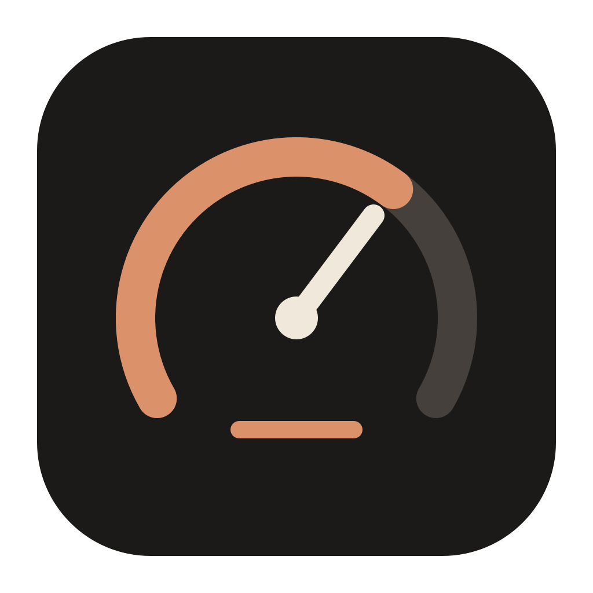
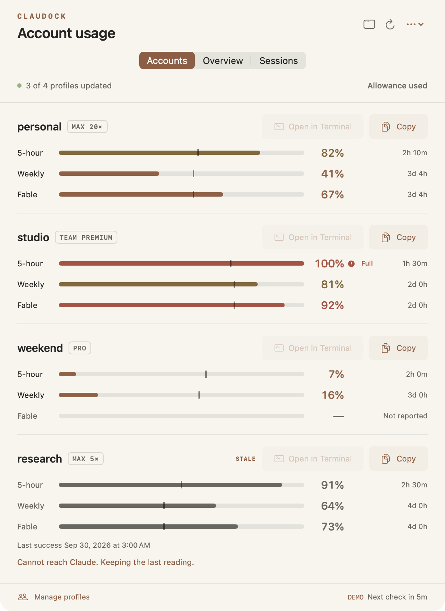
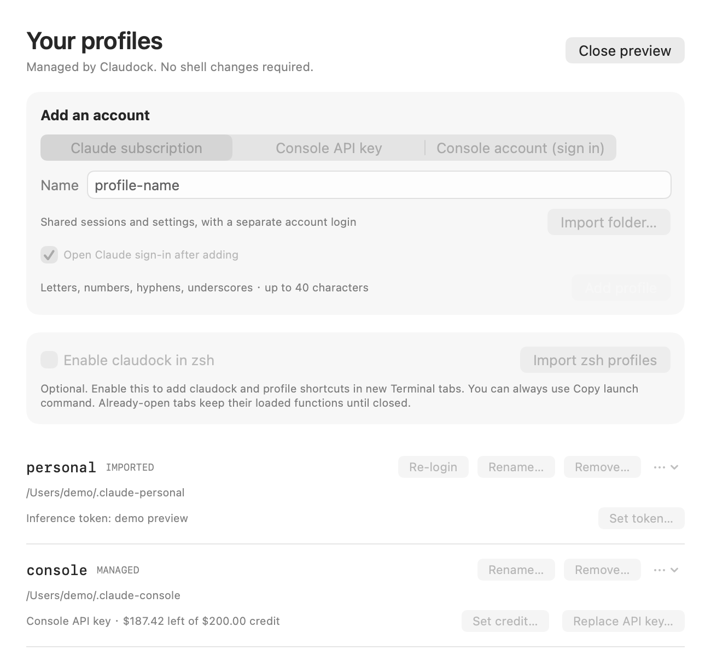
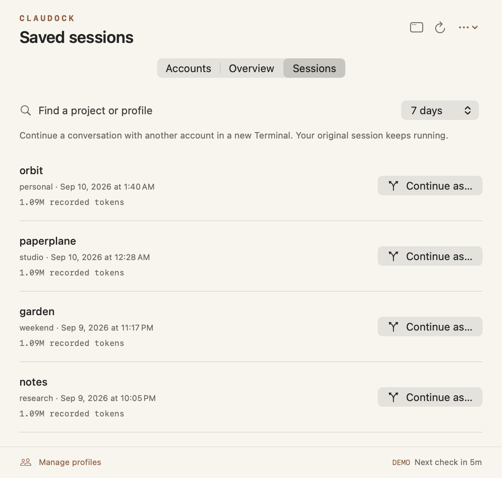

# Claudock

A macOS menu bar app and `claudock` command for people with more than one Claude account. See every account's limits and Console credit side by side, then start Claude Code under the one you pick.

[Download v1.7.0](https://github.com/luisleo526/claudock/releases/download/v1.7.0/Claudock-1.7.0-macOS-arm64.dmg) · [User guide](docs/GUIDE.md) · [Release notes](https://github.com/luisleo526/claudock/releases/tag/v1.7.0)

> This is v1.7.0, a preview for Apple Silicon and macOS 14 or newer. It is ad-hoc signed and not Apple-notarized. No Xcode is needed to run the app.

<picture>
  <source media="(prefers-color-scheme: dark)" srcset="docs/screenshots/accounts.png">
  
</picture>

*Synthetic demo profiles. Percentages show allowance used. The console and team rows are Console profiles.*

## Install

You need an Apple Silicon Mac with macOS 14 or newer, and [Claude Code](https://code.claude.com/docs/en/setup) to sign in and to start sessions.

1. Open the downloaded DMG and drag **Claudock.app** to **Applications**.
2. Open Claudock from Applications. This build is not notarized, so macOS may block it. Follow [Apple's instructions for opening an unnotarized app](https://support.apple.com/en-us/102445). After you try to open it, approve it under **System Settings → Privacy & Security → Open Anyway**.
3. Click the menu bar icon. On first launch Claudock imports your default Claude account and any `claude-NAME` zsh functions you already have, without running your shell files. Open **Manage profiles** to add more accounts.

Click elsewhere to close the popover. The window icon in its header opens the same dashboard in a regular window. Closing that window leaves the menu bar app running.

Terminal commands in this README start with `claudock`. That command exists in new Terminal tabs once you turn on [shell integration](#shell-integration-optional). Until then, type the app's path in its place: `'/Applications/Claudock.app/Contents/MacOS/claudock'`.

Also available: [ZIP archive](https://github.com/luisleo526/claudock/releases/download/v1.7.0/Claudock-1.7.0-macOS-arm64.zip) and [SHA256 checksums](https://github.com/luisleo526/claudock/releases/download/v1.7.0/Claudock-1.7.0-SHA256SUMS.txt).

<details>
<summary>Build from source</summary>

Building needs full Xcode 16 or newer. Open Xcode once to finish its setup, then run:

```sh
git clone https://github.com/luisleo526/claudock.git
cd claudock
./scripts/bootstrap.sh
```

You can also double-click **Bootstrap.command**. Bootstrap checks the toolchain, runs the tests, builds Claudock, and opens it. Quit the app, move it from `dist/Build.*/` to Applications, and open it again.

The build targets your Mac's architecture. Apple Silicon is validated; Intel is unverified. See the [development guide](CONTRIBUTING.md) and the [build and release details](docs/RELEASING.md).

</details>

## Add your accounts

Claudock has three kinds of profile. Pick the one that matches how the account is billed.

| Kind | Billed to | The dashboard shows |
| --- | --- | --- |
| Claude subscription (Pro, Max, Team, or Enterprise) | Your plan | 5-hour, Weekly, and Fable limits |
| Console account, signed in with a browser | The Anthropic Console organization you sign in to, per token | Console credit, once you set it |
| Console API key | The Console organization that owns the key, per token | Console credit, once you set it |

In the app, open **Manage profiles**: the button at the bottom of the dashboard, or **Manage profiles…** in the … menu. Under **Add an account**, choose the account type, type a name, and choose **Add profile**.

A name has 1 to 40 letters, numbers, hyphens, or underscores, and starts with a letter or number. The names `default` and `auto` are reserved. A new profile keeps its own login and shares session history, settings, plugins, and skills with your default `~/.claude` setup.

<picture>
  <source media="(prefers-color-scheme: dark)" srcset="docs/screenshots/profiles.png">
  
</picture>

*Synthetic demo profiles.*

### Which account for what

A Claude subscription suits interactive daily coding. The dashboard shows its 5-hour, Weekly, and Fable limits.

A Console profile, signed in or with an API key, suits headless work: scripts, agents, and other runs that take one prompt, print the answer, and exit. It is billed per token, and Claudock tracks the credit you set. See [Headless runs and automation](#headless-runs-and-automation).

Check that your Console credit covers interactive use before you rely on it. See [Interactive sessions on Console credit](#interactive-sessions-on-console-credit).

### Claude subscription

In the app, choose **Claude subscription**. Leave **Open Claude sign-in after adding** on to sign in right away. In Terminal:

```sh
claudock profile add work
claudock profile login work
```

To sign in again, choose **Re-login** on the profile's row in **Manage profiles**, or run `claudock profile login work`. Sign your browser in to the right claude.ai account first.

### Console account (sign in)

Claude Code signs in to your Anthropic Console account in the browser, creates an API key for it, and keeps the key itself. You paste nothing. Usage is billed per token to that Console organization.

In the app, choose **Console account (sign in)**. **Open Console sign-in after adding** is on by default. In Terminal, this adds the profile and starts the sign-in:

```sh
claudock profile add team --console
```

If you cancel the sign-in, the profile stays. Sign in again with **Sign in…** on its row in **Manage profiles**, or run `claudock profile login team`. Claudock checked this sign-in with Claude Code 2.1.295.

### Console API key

Use a key when someone gave you one, when the profile must use one particular key, or when you cannot sign in on this Mac. Otherwise a Console sign-in is simpler. Usage is billed per token to the key's Console organization.

In the app, choose **Console API key** and paste the key in **Key**. In Terminal, the key is read from standard input, never from arguments, and stored only in Keychain:

```sh
pbpaste | claudock profile add console --api-key
# or type the key at a prompt that hides it:
claudock profile add console --api-key
```

Replace the key with **Replace API key…** on the row in **Manage profiles**, or `claudock profile set-key console`. There is no sign-in to repeat for a key profile.

### Switch between a key and a sign-in

A Console profile can change from one to the other and keep its name, folder, and shared history:

```sh
claudock profile login console --console   # key profile: sign in to its Console account instead
claudock profile set-key team              # sign-in profile: use a pasted key instead (read as above)
```

The credential you stop using stays in Keychain, unused. The command prints its service name and how to delete it. A subscription profile cannot change kind. Add a separate profile for the Console account.

### Interactive sessions on Console credit

Console credit may cover headless runs but not interactive sessions. This is observed behavior, not documented by Anthropic.

Observed on 2026-10-09 with Claude Code 2.1.295, on Console organizations whose credit was a recent grant: `claudock run NAME -- -p "your prompt"` was accepted. An interactive session on the same profile was refused by Anthropic with `Credit balance too low · Add funds`, although the Console showed credit. The API message was `Your credit balance is too low to access the Anthropic API`. A pasted key and a Console sign-in behaved the same.

Claudock only starts Claude Code, so it cannot change this. If you see the message:

- Check the terms of the credit in the Console (Settings → Billing), or ask Anthropic whether it covers interactive use.
- Use a subscription profile for interactive work.
- Keep the Console profile for [headless runs](#headless-runs-and-automation).

Claudock's credit meter is built from the amount you entered, so it cannot tell you whether Anthropic accepts interactive use.

### Import, rename, remove

**Import folder…** and **Import zsh profiles** in Manage profiles bring in accounts you already use. Importing from zsh files only reads them and never runs them. **Rename…** and **Remove…** are on each row, except the default profile's. Removing keeps the profile's Claude folder, conversations, and credentials, and lists the credentials it left in Keychain. To delete those and the folder too, see [Remove a profile completely](#remove-a-profile-completely).

```sh
claudock profile add work --directory /Users/you/.claude-work
claudock profile import-shell
claudock profile rename work office
claudock profile remove office
```

### Remove a profile completely

Removing a profile keeps its folder, its conversations, and its credentials. To delete the credentials and the folder as well, follow these steps in order. Steps 2 to 4 cannot be undone.

1. Remove the profile in Terminal, or with **Remove…** in Manage profiles. The command prints each credential the profile left in Keychain, with the command that deletes it, and then the profile's folder, quoted for the shell, which the profile list no longer shows once the profile is gone. The app shows the same in its notice, which stays until your next action in Manage profiles, so copy what you need first. A profile can leave up to four items. The command prints those that exist, and marks any that Keychain could not be asked about:

   - `Claude Code-credentials-…`: Claude Code's login for the profile's folder, for a subscription or a Console account.
   - `Claude Code-…`: the API key Claude Code made when you signed in to a Console account.
   - `Claudock-inference-…`: an inference token saved in Claudock.
   - `Claudock-apikey-…`: a Console API key saved in Claudock.

   ```sh
   claudock profile remove console
   ```

   The output looks like this, here for a Console API key profile:

   ```text
   Removed console from Claudock. Claude data, its Console API key, and your own shell commands were preserved.
   Credentials left in Keychain. To delete one, run its command:
     Claudock Console API key
       security delete-generic-password -s 'Claudock-apikey-…'
   Config folder: '/Users/you/Library/Application Support/Claudock/accounts/…/claude'
   Keys and tokens stay valid at Anthropic until they are revoked in the Console or on claude.ai.
   ```

2. Delete the Keychain items you no longer need. Run the delete command that `profile remove` printed for each one. If you used the app, copy the commands from its notice. Keep an item that something else still uses: Claude Code keeps a folder's login in its `Claude Code-credentials-…` item, so deleting it signs out every shell command of yours that starts Claude with that folder. Each command looks like this, with the item's service in place of `SERVICE`:

   ```sh
   security delete-generic-password -s 'SERVICE'
   ```

3. Revoke the keys. Deleting an item does not revoke what it held: a key or token stays valid at Anthropic until it is revoked. Revoke a Console API key in the Console (Settings → API keys). For a Console sign-in, revoke the key Claude Code added to your Console workspace when you signed in. Revoke a Claude login or an inference token on claude.ai. Everything else that uses the key or token stops working.

4. Delete the profile's folder if you no longer need it. Quit any Claude session running under the profile first. A folder Claudock created, under `~/Library/Application Support/Claudock/accounts/`, holds the profile's own files and links to your shared `~/.claude`. `rm -r` deletes the links, not what they point to. A folder you imported with `--directory` holds its own conversations, so keep it unless you no longer need them. Never run `rm -r` on `~/.claude` itself: it is your default account and the history all profiles share. Put the quoted path from the `Config folder:` line in place of `CONFIG_FOLDER`. If the line ends with a note about control characters, the name shown is not exact, so delete the folder in Finder instead:

   ```sh
   rm -r CONFIG_FOLDER
   ```

Removal itself deletes nothing in Keychain. To delete only a saved inference token and keep the profile, run `claudock profile clear-token NAME` or choose **Delete token** in **Manage token…**; see [Inference tokens](#inference-tokens-optional). The default profile cannot be removed, so Claudock never prints a delete command for its own login.

## Start Claude with a profile

In the app, choose **Open in Terminal** on a profile's row. A new Terminal window opens in your home folder and starts Claude under that profile. **Copy** copies the launch command instead.

In Terminal, `claudock run` starts Claude in the current folder. Everything after `--` goes to Claude Code unchanged:

```sh
claudock run work
claudock run work -- --resume
```

With [shell integration](#shell-integration-optional), `claude-work` does the same as `claudock run work`.

If a profile uses a pasted API key (a Console API key profile), Claude asks the first time whether to use it. Answer Yes. Claude Code remembers the answer for that profile. A headless `-p` run uses the key without asking.

### Move a conversation to another profile

Reached a weekly limit? Continue the same conversation on another profile, for example a Console profile. New profiles share session history with your default `~/.claude` setup, so any of them can pick it up. Anthropic may refuse interactive sessions on a Console profile: read [Interactive sessions on Console credit](#interactive-sessions-on-console-credit) first. If it does, continue headless, as shown below.

In the app, open the **Sessions** tab, choose **Continue as…** beside a conversation, pick a profile under **Continue using**, and choose **Continue in Terminal**. A fork of the conversation opens in a new Terminal window in its project folder. Your original session keeps running.

<picture>
  <source media="(prefers-color-scheme: dark)" srcset="docs/screenshots/sessions.png">
  
</picture>

In Terminal, from the project folder:

```sh
claudock run console -- --resume
claudock run console -- --continue
```

`--resume` lets you choose a conversation. `--continue` takes the latest one in the current folder. If the conversation is still running in another Terminal, use `--resume SESSION_ID --fork-session`: Claude then starts a new session from its history while the original keeps running.

Continuation is a preview feature. It needs a Claude Code version that can resume a saved session file. [Compatibility details](docs/GUIDE.md#continue-a-saved-session).

If Anthropic refuses interactive sessions on the Console profile, continue headless instead. **Continue as…** always starts an interactive session, so use Terminal, from the project folder:

```sh
claudock run console -- -p --resume SESSION_ID "Carry on with the failing test"
claudock run console -- -p --continue "Carry on with the failing test"
```

`-p` prints Claude's answer and exits, so each command is one turn. Run another to send the next message. `--continue` takes the latest conversation in the current folder. SESSION_ID is the conversation's file name, without `.jsonl`, in a project folder under `~/.claude/projects`. For a conversation stored elsewhere, pass the file's absolute path instead.

If the conversation is still running in another Terminal, add `--fork-session` and `--output-format json` to the first command only. The new session gets its own ID, which the JSON shows as `session_id`: use it with `--resume` for the next messages. See [Headless runs and automation](#headless-runs-and-automation) for permissions and scripts.

### Headless runs and automation

Pass `-p` after `--` to run Claude non-interactively. Claude takes one prompt, prints the answer, and exits.

```sh
claudock run console -- -p "Summarize what this folder contains"
git diff | claudock run console -- -p "Review this diff"
claudock run console -- -p --output-format json "Summarize what this folder contains"
```

- `--output-format json` prints one JSON object. The answer is in `result`, and `session_id` names the conversation for a later `--resume`. `jq -r .result` prints only the answer.
- Claudock writes its own messages to stderr and passes Claude's exit status on, so a script can read stdout and test `$?`.
- Several runs can go at once, under different profiles or the same one. If another Claudock process is changing the profile registry, for example adding a profile, a run waits up to 5 seconds for it, then stops with `Another profile update is in progress. Wait a moment and try again.`
- A Console profile started this way counts toward its credit like any other launch from Claudock, parallel runs included. [How the credit is counted](docs/GUIDE.md#track-the-console-credit).
- A `-p` run shows no folder trust prompt, so a project's hooks and MCP servers run even in a folder you never trusted: run it only in folders you trust. It cannot ask you to approve a tool, so anything that would ask is denied unless a flag such as `--allowedTools` allows it. Claude Code's [headless guide](https://code.claude.com/docs/en/headless) covers these flags.

A wrapper of your own that runs `claude` directly, instead of `claudock run`, gets none of what Claudock adds: no saved key or inference token, no Console credit tracking, and no clearing of inherited authentication variables. Call `claudock run NAME -- …` from the wrapper instead.

## Watch limits and credit

The menu bar popover and the dashboard window list one row per profile. Claudock refreshes every 5 minutes by default. Choose a 1-, 5-, or 15-minute **Refresh interval** in the … menu. The refresh button asks again now, at most once a minute. The badge beside a subscription name is the plan Claude reports ([how badges are chosen](docs/GUIDE.md#account-plan-badges)). A Console profile's badge says API.

A subscription row has three bars: 5-hour, Weekly, and Fable. A bar that Claude does not report is left out, and other model limits show as small meters below.

- The percentage is the share of the allowance you have already used.
- The vertical tick shows how much of the time window has passed. A fill beyond the tick means you are using the allowance faster than time passes.
- The number on the right counts down to the reset.
- **Full** marks an allowance at 100% or more. **Not reported** means Claude reports no Fable allowance for that account.
- **STALE** means the last refresh failed. The bars turn grey and keep the last good reading, with its time.

A Console row has no limit bars. Once you set its credit, it shows a **Credit** meter such as `$187.42 left of $200.00`, and **LOW CREDIT** when less than 10% or $5 is left. A Console sign-in row also names its Console organization.

The **Overview** tab shows the tokens recorded in your local session logs over the last 7 or 30 days. They are not billing or allowance. [How they are counted](docs/GUIDE.md#local-token-activity). Appearance, launch at login, and other settings are in the … menu: [Make it yours](docs/GUIDE.md#make-it-yours).

### claudock usage

In Terminal, `claudock usage` prints the same numbers for scripts. It prints no email addresses or credentials. The output is tab-separated. Spaces are added here to line up the columns:

```text
PROFILE  PLAN         WINDOW                            USED_PERCENT  RESETS_UTC
work     Max 20×      5-hour session                    82.00         2026-10-09T16:10:00Z
work     Max 20×      Weekly · all models               41.00         2026-10-12T18:00:00Z
work     Max 20×      Weekly · Fable                    67.00         2026-10-12T18:00:00Z
console  Console API  Credit · $187.42 of $200.00 left  6.29          -
```

- `PROFILE` is the profile name.
- `PLAN` is the plan Claude reports, such as Pro, Max 5×, Max 20×, or Team Premium. A Console profile's credit row says `Console API`.
- `WINDOW` is the allowance the row describes: `5-hour session`, `Weekly · all models`, or a model limit such as `Weekly · Fable`. For a Console profile it is `Credit · $187.42 of $200.00 left`: the credit left, of the credit you set.
- `USED_PERCENT` is the share of that allowance already used, usually 0 to 100. It reaches 100 when the allowance, or the credit you set, is used up, and can go past it. It is not what is left. For a Console profile it is the share of the credit you set that has been spent.
- `RESETS_UTC` is when the allowance resets, in UTC. It is `unknown` when Claude gives no time, and `-` for credit, which does not reset.

A Console profile with no credit set has no row. A note on stderr names `claudock profile set-credit` instead. The exit status is 0 unless a profile has no reading at all.

### Cached readings and rate limits

The app and `claudock usage` share their readings, so the dashboard shows the last readings as soon as it opens, and frequent `claudock usage` calls do not each ask Claude. A reading younger than 3 minutes is printed without a request.

```sh
claudock usage --fresh
claudock usage --max-age 600
```

`--fresh` asks for new readings of every subscription profile. `--max-age SECONDS` (0 to 86400) accepts readings up to that many seconds old.

When Claude rate-limits an account (HTTP 429), Claudock stops asking for it until a cooldown ends, even with `--fresh`. The cooldown is the time Claude gives, between 5 minutes and a day. Without one, it is 1 minute, doubling up to 30 minutes. Meanwhile `claudock usage` prints the account's last reading, adds one line on stderr, and exits 0. The time in that line is local time:

```text
claudock: work: rate limited until 14:05; showing reading from 3 min ago.
```

### Console credit

Anthropic offers no API for the credit left on a Console organization, so you enter it yourself. Look it up in the Claude Console, then set it:

```sh
claudock profile set-credit console 187.42
```

Or choose **Set credit…** on the profile's dashboard row or in Manage profiles. The amount is in US dollars, from 0 to 1,000,000, with at most two decimals.

From then on, Claudock subtracts the cost Claude Code reports for each request in the sessions Claudock starts on this Mac: `claudock run`, the profile's shortcut, **Open in Terminal**, and **Continue as…**. [How the credit is counted](docs/GUIDE.md#track-the-console-credit).

This is an estimate, and the Console balance is authoritative:

- Use of the same key elsewhere, such as other Macs, scripts, or other tools, is not seen.
- Claude Code sessions started without Claudock are not seen.
- Spend from before you set the credit does not count.
- A Claude Code process killed outright (`kill -9`) loses the requests of its last second.
- A Claude Code settings file that sets `OTEL_…` variables or `CLAUDE_CODE_ENABLE_TELEMETRY` can send the reports elsewhere. Claudock names such a setting before it starts Claude. For these launches it also replaces any `OTEL_…` variables in your own environment.

Set the credit again from the Console whenever you check it.

## Inference tokens (optional)

An inference token is a long-lived Claude Code token (`sk-ant-oat01-…`) for a subscription profile. Claudock keeps it in Keychain and passes it to Claude Code when it starts that profile, so Claude Code uses it instead of the profile's normal login. Console profiles do not use tokens.

In the app, open **Manage profiles** and choose **Set token…** (or **Manage token…**) on the profile's row. **Paste token** saves a token you already have. **Create in browser** makes a new one. When a token is saved, or its status cannot be read, **Delete token** removes it from Keychain after you confirm.

In Terminal:

```sh
claudock profile setup-token work
pbpaste | claudock profile set-token work
claudock profile tokens
claudock profile clear-token work
```

- `setup-token` runs Claude Code's own token command for the profile. It signs in through your browser, so sign the browser in to that profile's claude.ai account first. A private window per account helps. Claude then prints a token.
- Copy the token, then run `set-token`. It reads the token from standard input, never from arguments, and saves it in Keychain. Add `--expires 2027-10-09` if you know when it expires.
- `tokens` lists each profile's token status and expiry, never the token. The status is `none`, `active`, `expired`, `pasted-unverified`, `n/a`, or `unavailable`.
- `clear-token` deletes the token Claudock saved for the profile from Keychain, and only that: Claude Code's own login stays. It exits with status 1 when no token is saved. Afterwards `tokens` shows `none`, and a launch uses the profile's normal login, or stops if you require a token (below). It does not revoke the token at Anthropic.

To make sure a launch never falls back to a profile's normal login, require a token:

```sh
claudock require-token on
claudock require-token status
claudock require-token off
```

With it on, `claudock run`, shortcuts, **Open in Terminal**, and **Continue as…** stop with instructions when a subscription profile's token is missing, expired, or unreadable. Signing in and `profile setup-token` always work. The same setting is **Require inference token to launch** in the … menu. It is off by default.

Quota reading still uses the profile's normal login. A re-login warning in the dashboard does not mean the token expired.

## Shell integration (optional)

The app works without it, and so does the CLI through its full path. To get the `claudock` command and `claude-NAME` shortcuts in zsh, open **Manage profiles**, turn on **Enable claudock in zsh**, and open a new Terminal tab. Put the app in its final location first.

- It adds the `claudock` command and a shortcut for each profile, such as `claude-work`.
- It writes `init.zsh` and an `integration.json` record in `~/.config/claudock/`, and adds one marked loader block to `.zshrc`, after backing up an existing file.
- Adding, renaming, or removing a profile never edits `.zshrc`. Shells running the current integration pick up new shortcuts before your next command.
- Your own aliases, functions, and programs with the same name win. Use `claudock run NAME` for those profiles.
- A wrapper you wrote that runs `claude` directly, instead of `claudock run`, does not use saved inference tokens or Console credit tracking.

If integration was on before you updated from a version older than 1.6.0, open the updated app once, then load the new version in each open tab:

```sh
source ~/.config/claudock/init.zsh
```

You can also turn integration on from Terminal with the app's own command, which works without any shell setup:

```sh
'/Applications/Claudock.app/Contents/MacOS/claudock' shell enable
```

[Shell setup, custom dotfiles, and more](docs/GUIDE.md#optional-shell-integration).

## Command cheat sheet

`claudock help` prints this list with more notes.

```sh
claudock profile list                                       # List profiles, selectors, and kinds
claudock profile add NAME [--directory ABS_PATH]            # Add a subscription profile, or import a folder
claudock profile add NAME --api-key [--directory ABS_PATH]  # Add a Console API-key profile (key from stdin)
claudock profile add NAME --console [--directory ABS_PATH]  # Add a Console profile and sign in in the browser
claudock profile set-key NAME                               # Save a Console API key (key from stdin)
claudock profile set-credit NAME AMOUNT                     # Record the Console credit left, in US dollars
claudock profile set-token NAME [--expires ISO8601_DATE]    # Save an inference token (token from stdin)
claudock profile setup-token NAME                           # Create an inference token through Claude Code
claudock profile tokens                                     # Show each profile's token status
claudock profile clear-token NAME                           # Delete a profile's saved inference token
claudock profile rename NAME NEWNAME                        # Rename a profile; its data and login stay
claudock profile remove NAME                                # Remove a profile; Claude data and credentials stay
claudock profile login NAME [--console]                     # Sign in again; --console uses a Console account
claudock profile import-shell                               # Import claude-NAME functions from your zsh files
claudock run NAME [-- CLAUDE_ARGS...]                       # Start Claude Code under a profile
claudock usage [--max-age SECONDS | --fresh]                # Print limits and Console credit
claudock require-token on|off|status                        # Require an inference token to launch
claudock shell enable|disable|status                        # Turn zsh integration on or off, or check it
claudock version                                            # Print the version
claudock help                                               # Print this list and notes
```

`claudock auto` was removed in 1.6.0. It prints a notice on stderr and exits with status 2. Use `claudock run NAME`.

## Troubleshooting

| Symptom | What to do |
| --- | --- |
| `Claude is limiting requests. Refresh will retry after a cooldown.` | Claude rate-limited that account. Wait. Claudock asks again when the cooldown ends, and `--fresh` does not skip it. The last good reading stays on screen, and `claudock usage` prints it with a `rate limited until` note. |
| `The account information does not match this profile. Use the matching account or replace its token.` or `NAME's saved inference token belongs to a different account than its current Claude login.` | The token and the profile's login are for different accounts. Sign the browser in to the right claude.ai account, then run `claudock profile login NAME` to fix the login, or make a token for the current login: choose **Create in browser** in **Set token…**, or run `claudock profile setup-token NAME` and save it as shown under Inference tokens. |
| `Sign in to this Claude profile to see usage.` | The profile has no usable login. Choose **Re-login** in **Manage profiles**, or run `claudock profile login NAME`. |
| `NAME is not signed in to a Console account. Sign in with: claudock profile login NAME` | The Console sign-in was cancelled, failed, or removed. Run that command, or choose **Sign in…** on the profile's row in **Manage profiles**. |
| `Credit balance too low · Add funds` in an interactive session on a Console profile | Check the balance in the Console first, and add funds there if the credit is used up. If the Console shows credit and headless `-p` runs work, Anthropic may refuse interactive use of that credit. See [Interactive sessions on Console credit](#interactive-sessions-on-console-credit). |
| The browser is signed in to the wrong account during a sign-in or `setup-token` | Use a private browsing window, one per account, or sign the browser out first. |

More messages and fixes are in the [guide's troubleshooting table](docs/GUIDE.md#troubleshooting).

## Local by design

- No Claudock account and no hosted backend. Profiles live on your Mac.
- No telemetry and no transcript uploads. Local activity is read locally. For Console credit, Claudock points Claude Code's per-request cost reports at `claudock` itself on `127.0.0.1`, so they stay on the Mac unless a Claude Code setting of yours redirects them.
- Quota credentials stay in Claude's existing store. Inference tokens and Console API keys use their own Keychain items and reach Claude only through its launch environment.

Starting or continuing Claude is an explicit action. It uses Claude's normal settings, authentication, and permissions. See [privacy and security details](SECURITY.md).

Claudock is an independent open-source project, unaffiliated with Anthropic. Live subscription limits come from Claude's undocumented OAuth usage endpoint. It can change or disappear without notice, and Claudock cannot guarantee continuous access.

## Contributing

[Report a bug](https://github.com/luisleo526/claudock/issues) with what you clicked, what you expected, and your macOS and Claude Code versions. Use demo screenshots or redact account details. Report security issues through the [private reporting guidance](SECURITY.md).

Contributions to accessibility, profile discovery, and compatibility are welcome. The app uses SwiftUI and AppKit, with no third-party Swift package dependencies. Read the [contribution guide](CONTRIBUTING.md) and the [architecture notes](docs/ARCHITECTURE.md).

## License

[MIT](LICENSE). Claude and Claude Code are trademarks of their respective owner.
