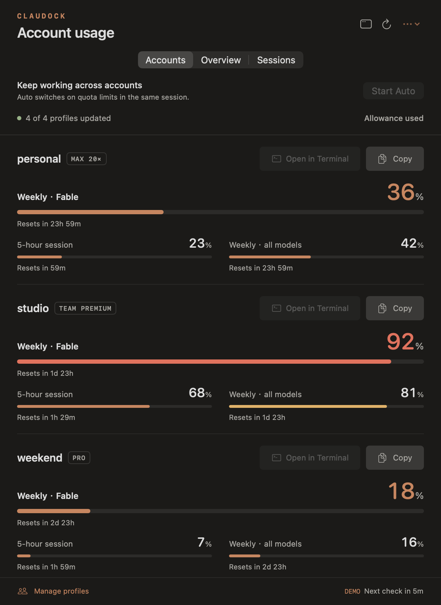
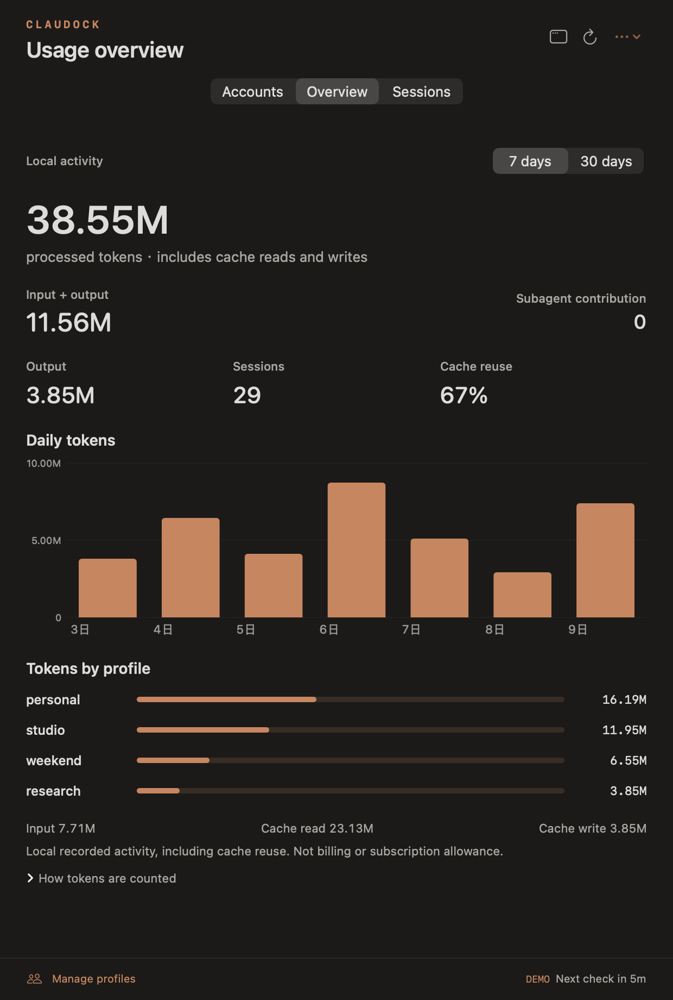

# Claudock user guide

A native Mac menu bar app that puts your Claude Code accounts in one place. Check subscription limits, explore recorded token activity, continue a saved session with another profile, and manage profiles from one app-owned registry. Optional shell integration adds `claudock` and missing `claude-{profile}` shortcuts while preserving the commands you already use.

Built with SwiftUI and AppKit, with no third-party package dependencies. Requires macOS 14 or newer.

Claudock is an independent open-source project, unaffiliated with Anthropic. Live subscription limits use Claude's undocumented OAuth usage endpoint. Availability and response formats can change without notice; this app cannot guarantee continuous access.

<p> </p>

Screenshots use the built-in synthetic demo. No real account data is shown.

Each account row has **Open in Terminal** to start that profile and **Copy** to copy its launch command. Copy displays a visible confirmation; launch failures appear beside the account. Unresolved custom wrappers retain the Copy action until their subscription config is imported.

## Get started

For a packaged build, open **Claudock.app** and move it to **Applications**. No Xcode is needed to run the app. A local or CI build is signed ad hoc and is not notarized; it does not have the Gatekeeper trust of a Developer ID signed, notarized release. Only open a downloaded build from a source you trust, using macOS's standard **Privacy & Security → Open Anyway** flow if needed.

To build from source, install **Xcode 16 or newer**, open Xcode once to finish setup, then double-click **Bootstrap.command**. Or run this from the repository:

```sh
./scripts/bootstrap.sh
```

Bootstrap checks the Mac and Swift toolchain, runs the tests, packages a fresh app under `dist/Build.*/`, and opens it. It does not install dependencies, change your shell configuration, or enable launch at login. A full Xcode installation is needed for the test frameworks; Command Line Tools alone are insufficient. With Xcode in a custom location, set `DEVELOPER_DIR` to that app's `Contents/Developer` directory before running the script.

The setup guide introduces the app, imports existing Claude profiles without executing your shell, detects the Claude executable, and explains menu bar access and email visibility. New users can manage every account through the app; shell integration is optional. Choose **Add an account** to open profile management, or **Open my dashboard** to start monitoring. You can reopen the guide later with **Settings → Show setup guide…**.

Click the menu bar icon to open the usage popover; click elsewhere to close it. For more room, click the window icon in the header or right-click the menu bar icon and choose **Open dashboard**. The dashboard is an ordinary resizable window that you can minimize or close. Closing it keeps the menu bar app running.

Install and sign in to [Claude Code](https://code.claude.com/docs/en/setup) to obtain live account limits. In **Manage profiles**, enter a name and choose **Add profile** to create an account. **Import folder…** lets you use an existing Claude config directory. **Open Claude sign-in after adding** is selected by default. For an existing account, choose **Re-login**, finish authentication in Terminal, and refresh the dashboard. If Claude Code is installed in a custom location, choose **Locate Claude executable…** in Settings.

## Your profiles, together

On first use, Claudock imports the default `claude` account and statically reads zsh functions and aliases named `claude-{profile}`. Later refreshes use its own profile registry. Use **Import zsh profiles** in the app or `claudock profile import-shell` to rescan external declarations. Common declarations import directly:

```zsh
claude-work() {
  CLAUDE_CONFIG_DIR="$HOME/.claude-work" claude "$@"
}

alias claude-personal='CLAUDE_CONFIG_DIR="$HOME/.claude-personal" claude'
```

Discovery reads `.zshenv`, `.zprofile`, and `.zshrc`, following bounded literal `source` paths. It does not execute your shell startup files. Wrappers with dynamically computed paths can need a manual import. The app also recognizes literal `_claude-native` config-directory wrappers. Secret-looking source files are skipped.

The **Accounts** tab puts an explicitly reported Fable allowance first, using a full-width progress bar and a larger percentage. If several Fable allowances are returned, the most used one leads; its title identifies the exact window. Session and overall weekly limits sit underneath, and other model-specific limits also have progress bars. Without a reported Fable allowance, the standard session/week layout is retained. Percentages represent **used** allowance. Accounts refresh sequentially, by default five minutes after a refresh completes. Choose a 1-, 5-, or 15-minute interval in Settings. Manual refresh has a one-minute cooldown. Rate limits delay the next attempt for that account, and failures retain the last reading with a stale indicator.

## Local token activity

The **Overview** tab summarizes recorded activity across profile config folders for **7 days** or **30 days**, including today. The headline shows **processed tokens**, including cache reads and writes. **Input + Output** is shown separately, and **Subagent contribution** identifies the portion already included from recognized subagent logs. It also includes a daily chart, per-profile totals, output tokens, session count, and cache reuse. Hover a profile total for its input, output, cache read, and cache write breakdown.

Recorded tokens are the sum of input, output, cache read, and cache creation counters in local Claude session logs. Reused context counts on each request, so the total is not a count of unique text. Cache reuse is cache-read tokens divided by input plus cache-read plus cache-write tokens. These figures describe local recorded activity; they do not measure account billing or subscription allowance.

The scanner reads main session JSONL files under each profile's `projects` folder, plus direct subagent logs and recognized workflow logs under `<project>/<sessionUUID>/subagents/workflows/wf_*/`. It supports shared or symlinked `projects` roots. New profiles created by Claudock share the default `~/.claude` history. When multiple profiles point to the same history folder, the app scans it once and labels its totals **Shared history**. Claude's local logs do not provide a reliable account identifier, so shared history cannot be split accurately between those accounts.

Per-profile totals are available when history folders are isolated. Duplicate message history across main, subagent, copied, and forked logs is counted once using message identifiers; attribution among isolated copies goes to the oldest local file copy. This is a local attribution heuristic, not proof of which account was originally billed. Deleted logs, other computers, unsupported records, and unrecognized log locations are outside the totals.

History scanning runs in the background with a 120-second and 8 GiB total read budget, up to 50,000 files, 512 MiB per file, and 32 MiB per line, plus directory-entry and message limits. The dashboard shows scanned versus eligible files and the scan time. **Partial local history** means some records were unreadable, invalid, or skipped because of a limit; the total is then incomplete. Matching file counts alone do not guarantee every record was usable. The app keeps summaries in memory and does not upload transcripts or analytics.

## Continue a saved session

In **Sessions**, search by project or profile, choose a 7- or 30-day period, and select **Continue as…** beside a session. Choose the destination under **Continue using**, then select **Continue in Terminal**. The list shows up to the 100 most recent matching sessions from the local scan.

The app opens the original project directory in a new Terminal and starts Claude Code under the chosen profile with `--resume` pointing to the source JSONL file and `--fork-session`. The source file stays in place, and an existing Terminal session is not stopped. The new session uses the target profile's Claude settings and login. Claude Code's normal project trust and tool permission prompts still apply.

This requires Claude Code's support for an absolute JSONL resume path. That argument support was checked against Claude Code **2.1.263**; compatibility with other versions and a successful live account-to-account continuation are separate checks. A missing project directory or unavailable source file prevents launch. If the destination needs authentication, use **Re-login** first.

## Make it yours

Open the **…** menu in the header for Settings. Preferences are saved locally.

- **Show account emails** is optional and off by default.
- **Highest usage first** brings accounts nearest a limit to the top.
- **Compact account rows** reduces spacing in Accounts.
- **Refresh interval** offers 1, 5, or 15 minutes; the default is 5.
- **Appearance** offers System, Light, and Dark.
- **Accent** offers Copper, Sage, Iris, and Blue.
- **Launch at login** can be enabled from Settings after placing the app in Applications.
- **Locate Claude executable…** selects a custom Claude installation for actions launched by the app.
- Closing the dashboard keeps the menu bar app running. Use Settings or right-click the menu bar icon to quit.

Claudock accepts Claude Pro, Max, Team, and Enterprise subscription profiles. External-provider wrappers such as Vertex, Bedrock, and Foundry are excluded from import. Legacy cloud registrations are removed from the app without deleting their configuration or shared history.

## Manage profiles

Use **Manage profiles** to add or import accounts, rename them, re-login, and remove them from Claudock. You can use these actions entirely through the app. Adding, renaming, and removing profiles do **not** change `.zshrc`.

Claudock saves names and directory bindings in:

```text
~/Library/Application Support/Claudock/profiles.json
~/Library/Application Support/Claudock/accounts/<stable-id>/claude/
```

New accounts receive a private, stable config directory whose UUID does not depend on the display name. This keeps each account's login separate. The directory links its projects and history, plus common settings, plugins, and skills, to the default `~/.claude` setup. You can keep using the same conversations and preferences across accounts; changes to shared settings affect the profiles linked to them.

Importing an explicit existing folder preserves its paths, credentials, history, and layout without adding these links. Renaming never moves an account directory. Removing a profile only removes its Claudock registration; it preserves Claude conversations, settings, credentials, and original shell wrappers. The default account is protected from rename and removal.

When upgrading from Claude Usage, active shell declarations are imported, including the old `~/.config/claude-usage/profiles.zsh` when it is sourced by zsh. Legacy files remain intact; an orphaned old JSON registry with no active wrapper is not automatically imported, so use Import folder for those accounts. Claudock does not rewrite old generated wrappers or remove their source line. Existing external `claude-NAME` wrappers continue to be owned by their original shell configuration; renaming or removing a Claudock entry does not rewrite those commands.

### Optional shell integration

Open **Manage profiles → Enable claudock in zsh** to install the `claudock` command and shortcuts such as `claude-work`. Place the app in its final location first. Enabling creates `~/.config/claudock/init.zsh` and adds only this named loader block to `.zshrc`, with an exact backup before changing an existing shell file:

```zsh
# >>> Claudock shell integration >>>
[[ -r "$HOME/.config/claudock/init.zsh" ]] && source "$HOME/.config/claudock/init.zsh"
# <<< Claudock shell integration <<<
```

**First setup:** open a new Terminal tab to load the integration. It creates missing `claude-NAME` functions for available profiles. Existing aliases, functions, and executables keep their names; `claude` itself is preserved. When a name is already in use, select the account explicitly with `claudock run NAME`.

**After upgrading to 1.4.0:** launch the updated app. It upgrades an enabled, unchanged Claudock-owned integration v1 to v2 without turning integration on for users who left it off. Upgrade failures appear in Manage profiles. An already-open Terminal still has its old function definitions: open a new tab, or run this once in each existing tab:

```zsh
source ~/.config/claudock/init.zsh
```

**Later profile changes:** once v2 is loaded, shortcuts synchronize when the file is sourced, before each prompt (`precmd`), and before the next entered command (`preexec`). A profile added through the GUI while Terminal is idle is available before you run your next command. Renamed or removed profiles clean up only generated functions whose bodies still match Claudock's recorded definitions; custom edits and other user commands remain intact. These updates change the running shell's functions, not `.zshrc`.

```sh
claudock profile list
claudock profile add work
claudock profile login work
claude-work
claudock profile rename work office
claude-office
claudock run office -- --resume
claudock usage
claudock profile remove office
```

The namespaced command and generated shortcuts call the CLI bundled inside the app. Shortcuts forward the full profile selector, such as `claude-office`, so similarly named profiles remain distinct. The internal `claudock shell profile-names` helper reads the existing registry and emits selectors as data; it does not discover accounts, create or write the registry, access credentials, or make network requests.

Disabling integration removes Claudock's marked loader block and managed integration files. Open a new Terminal tab afterward to unload its functions and hooks; already-open shells retain what they loaded. Existing user shell declarations remain unchanged.

Import a pre-existing account with `claudock profile add work --directory /absolute/config/folder`. `profile login` and `run` replace the CLI process with Claude in the **current Terminal and working directory**, using the selected account's config directory and a cleared set of conflicting authentication/provider settings. Additional Claude arguments go after `--` and are forwarded as literal arguments without shell evaluation. The configured Claude executable in Settings applies to both the app and CLI.

`claudock usage` makes one sequential quota request for each supported profile and prints tab-separated profile, usage-window, used-percentage, and reset-time columns. It prints no emails or credentials and exits unsuccessfully if a requested profile fails. This reports subscription allowance; use Overview for local token activity. `claudock shell status`, `enable`, and `disable` expose the same optional integration controls. If the app moves, enable integration again from the app's new location to update its executable path.

Without shell integration, all GUI features work and the CLI can still be invoked by its absolute path:

```sh
'/Applications/Claudock.app/Contents/MacOS/claudock' profile list
```

Automatic integration refuses a symlinked `.zshrc` or a detected custom `ZDOTDIR` so it does not modify the wrong startup file. For a dotfile manager or custom shell layout, keep integration off and add this function to your own shell configuration, adjusting the app path to its actual location:

```zsh
function claudock() {
  command '/Applications/Claudock.app/Contents/MacOS/claudock' "$@"
}
```

This minimal manual setup provides only `claudock`. Use `claudock run NAME`, or define your own shortcuts through your dotfile manager.

## Privacy and permissions

The app reads each profile's existing Claude OAuth credentials from the corresponding macOS Keychain item, with Claude's `.credentials.json` fallback only when that item is absent. Access tokens are sent to `https://api.anthropic.com/api/oauth/usage`. When an access token expires or that endpoint returns HTTP 401, Claudock uses the saved refresh token at `https://platform.claude.com/v1/oauth/token` and updates the same existing credential store. Both HTTP clients reject redirects and use ephemeral sessions without cookies or caches.

There is no analytics service, telemetry, or developer-operated backend. Automatic renewal coordinates with Claude Code's credential locks, preserves unrelated fields, and stores replacement refresh tokens returned by Anthropic. It does not renew on quota HTTP 403, 429, or network failures. When the refresh token is missing, expired, or rejected, re-login delegates to Claude Code in Terminal through a temporary local command file that deletes itself when it runs. macOS may request Keychain access. Profile configuration contains local paths and names; keep it out of public issues and repositories. See [SECURITY.md](../SECURITY.md) for reporting guidance.

## Troubleshooting

| Message or symptom | What to do |
| --- | --- |
| Profile is missing | Rescan shell profiles, or import its config folder in Manage profiles. Shell import needs a `claude-NAME` wrapper with a literal path. |
| Config directory cannot be resolved | Replace a computed path with a literal `CLAUDE_CONFIG_DIR`, or import the profile. |
| This login cannot be renewed | Choose Re-login, finish Claude Code authentication in Terminal, then refresh. |
| Credential update is busy | Retry after a minute or open the profile in Claude Code. Claudock does not steal existing or stale lock directories. |
| Could not update saved credentials | Unlock Keychain and retry. Claudock retains a successful renewal in memory while retrying its save; closing the app loses that unsaved result. |
| The last renewal could not be confirmed | Open the profile in Claude Code or re-login. Claudock will use the updated credential; it will not resend a potentially consumed refresh token. |
| This credential cannot read usage | Check the account and credential permissions in Claude Code. This error does not trigger token renewal. |
| Keychain access unavailable | Unlock the Mac, respond to any Keychain access prompt, then retry. |
| HTTP 429 / cooldown | Wait for the displayed retry time. Repeated refreshes will not bypass it. |
| Unrecognized usage response | The upstream endpoint may have changed. Report the app version and message; do not attach credentials or raw responses. |
| `claudock` is unavailable | Enable **Manage profiles → Enable claudock in zsh**, then open a new Terminal tab. If the app moved, enable integration again from its new location. |
| Profile exists in the app, but `claude-work5` is not defined | Confirm integration is enabled. After upgrading, launch the new app and open a new tab or run `source ~/.config/claudock/init.zsh` once. Then try `claude-work5`; `claudock run work5` also works. |
| A shortcut runs my original wrapper or executable | Existing commands take priority. Use `claudock run NAME` to select the Claudock profile explicitly. |
| Token totals look larger than expected | Totals include cache reads/writes and count context reused on separate requests. They are not unique tokens, billed cost, or quota. |
| Partial history | The bounded local scan skipped data. Select 7 days for a smaller window; totals remain a partial view. |
| Tokens appear under Shared history | New profiles share the default Claude history. Profiles with the same resolved `projects` folder contribute one set of logs; account attribution is unavailable. |
| Continue as… is unavailable | The saved log has no usable project path. A project folder must exist to continue there. |
| Claude rejects a resume file | Confirm your Claude version supports absolute JSONL paths with `--resume`; the app's compatibility check used 2.1.263. |
| Launch at login needs approval | Check System Settings → General → Login Items & Extensions. |

## Development and builds

```sh
xcrun swift test
python3 Tests/CLIIntegration/check.py
./scripts/build-app.sh
open 'dist/Claudock.app'
```

`build-app.sh` accepts an output directory and refuses to overwrite an existing `Claudock.app`. It builds both `ClaudockApp` and `claudock`, stages them inside the app under `.build/`, generates an AppKit vector icon, validates the plist, signs the bundled CLI before signing the app, and verifies both signatures. The package uses Swift tools 6.0 and Swift 5 language mode. The GitHub Actions workflow tests and packages on macOS 15 and retains an app ZIP as a build artifact. CI does not publish releases.

Build and prepare releases outside cloud-synced folders. Some file providers attach Finder metadata to `.app` bundles after a build, causing a later signature check to fail even when packaging passed. The build removes disallowed metadata from its new bundle before signing and checks the final path, but cannot prevent subsequent changes by other software. Apple's [code-signing guidance](https://developer.apple.com/library/archive/qa/qa1940/_index.html) explains this error.

The build targets the machine's architecture. Build on Apple Silicon for arm64 and on Intel for x86_64; the current script does not produce a universal binary. Intel support has not been verified. A passing build on one architecture is not verification on the other. See [CONTRIBUTING.md](../CONTRIBUTING.md), [docs/ARCHITECTURE.md](ARCHITECTURE.md), and the [release checklist](RELEASING.md).

### Synthetic preview

Use demo mode to explore the interface or capture screenshots with synthetic data:

```sh
'dist/Claudock.app/Contents/MacOS/ClaudockApp' --demo
```

Demo mode opens an ordinary dashboard window with a **DEMO** indicator. It skips real account discovery, credential access, local-history scanning, and usage network requests. Profile changes, sign-in, and session continuation are disabled. Appearance preferences still use the app's local settings. Quit the preview and open the app normally to monitor your accounts from the menu bar.

### Read-only local analytics diagnostics

To print local token categories and scan coverage without opening the UI, reading credentials, or requesting live quota:

```sh
'dist/Claudock.app/Contents/MacOS/ClaudockApp' --analytics
```

For a fixed upper timestamp, use `--through` with an ISO 8601 value. This example captures the current UTC time before scanning:

```sh
SCAN_CUTOFF=$(date -u '+%Y-%m-%dT%H:%M:%SZ')
'dist/Claudock.app/Contents/MacOS/ClaudockApp' --analytics --through "$SCAN_CUTOFF"
```

The diagnostic uses the current seven-calendar-day window; `--through` changes its upper cutoff, not the start date. It prints totals, input/output/cache counters, per-profile or shared-history totals, scanned/eligible files, bytes, and a partial flag. It does not modify logs or freeze files being written by Claude. Output can reveal profile names and activity; redact it before sharing.

For a distributable release, use your own Apple Developer ID Application identity:

```sh
CODE_SIGN_IDENTITY='Developer ID Application: Your Name (TEAMID)' ./scripts/build-app.sh dist/signed
ditto -c -k --sequesterRsrc --keepParent 'dist/signed/Claudock.app' dist/Claudock-submission.zip
xcrun notarytool submit dist/Claudock-submission.zip --keychain-profile ClaudockNotary --wait
xcrun stapler staple 'dist/signed/Claudock.app'
xcrun stapler validate 'dist/signed/Claudock.app'
spctl --assess --type execute --verbose=2 'dist/signed/Claudock.app'
ditto -c -k --sequesterRsrc --keepParent 'dist/signed/Claudock.app' dist/Claudock-release.zip
```

These commands assume you have configured a `ClaudockNotary` Keychain profile with Apple's `notarytool store-credentials`. Signing enables the hardened runtime. Check that notarization reports **Accepted** before stapling or distributing. The Claudock migration intentionally retains the previous `io.github.claudeusage.ClaudeUsage` bundle identifier to preserve preferences and login-item identity. A new fork should choose its own identifier before its first release and keep GUI/CLI preference domains consistent. No signing credentials or notarization service setup are included in this repository.

## License

[MIT](../LICENSE). Claude and Claude Code are trademarks of their respective owner.

Automatic token renewal runs in the resident menu bar app. The one-shot `claudock usage` command reads quota without rotating credentials; an expired-token message directs you to Claudock or the relevant Claude profile.

## Auto account selection

With zsh integration enabled, run `claude-auto` like any `claude-{slug}` command. No arguments starts a new conversation. `claude-auto --continue` selects the latest conversation in the current project; `claude-auto --resume SESSION_ID` resumes a particular conversation. Add `--fork-session` when the source is still running to continue its history in a new session. Sessions and history are shared with the default Claude workspace. Imported isolated histories can be resumed by absolute JSONL path or through the app's Sessions view.

An unchanged v1/v2 shell adapter upgrades to v3 automatically when the app starts. Existing tabs can run `source ~/.config/claudock/init.zsh` once; new tabs load it automatically. Existing user commands or legacy profiles named `claude-auto` are preserved, so use explicit `claudock auto` when a collision exists.

Choose **Start Auto** in Accounts, or run `claudock auto` from your project directory. Use `claudock auto --profiles work,personal -- --resume` to restrict the pool and continue a shared conversation. **Sessions → Continue as… → Auto** opens a fork in a new Terminal; the original session remains running.

Auto keeps a conversation on its selected account while it has capacity, then switches after a status-phase quota/auth rejection. It considers the requested model's limits together with global session/weekly limits. At most three distinct credential stores are attempted for a request. Existing partial output, uncertain network failures, and account-owned remote state are not replayed on another account. Independent Auto sessions have independent pools; this version does not run a central cross-session scheduler.

Auto is opt-in per launch. Ordinary `claude-{slug}` shortcuts remain pinned to their named profile. Auto uses the default shared Claude workspace and preserves Claude's normal project/tool permission checks.

## Long-lived inference tokens

Open **Manage profiles → Set token…** (or **Manage token…** for an existing token). **Paste token** is selected by default. Paste a raw `sk-ant-oat01-…` token or its `export CLAUDE_CODE_OAUTH_TOKEN=…` assignment and choose **Save to Keychain**. The input is parsed as data, never executed. Import does not require a browser or a prior normal Claude login.

Pasted tokens are assigned manually to the selected profile. Their provider account identity cannot be verified from the opaque value; expiry is shown as unknown unless supplied. Use the matching account's token when pairing it with a quota-monitoring login.

The **Create in browser** option remains available for new tokens. It opens Claude authorization and accepts the returned `code#state` in its own field. That flow verifies account/organization against the profile's existing login and uses the expiry reported by Claude, requesting one year by default.

Saved tokens are preferred by GUI launches, managed shortcuts, `claudock run`, and Auto. They survive renames. Imported user-authored wrappers retain their previous authentication; use the copied Claudock command for those profiles. Removing a profile preserves token data and does not revoke it remotely.

Quota monitoring still uses normal OAuth. A monitoring re-login warning does not mean an independently saved inference token has expired. Revoked or expired tokens need replacement; an unknown expiry is not a promise of unlimited validity.

## Account plan badges

Claudock reads `subscriptionType` and `rateLimitTier`, using the mappings verified in Claude Code 2.1.270. Max 5×, Max 20×, and Team Premium display distinct badges. Missing or unrecognized Max/Team subtypes remain **tier unknown**. A lower quota or an unfamiliar Team rate is not enough evidence to call a seat Standard.

## Claude.ai connectors with Auto

Auto preserves your default Claude.ai login for connectors while selecting inference accounts independently. Keep that default login signed in with its normal OAuth permissions; pasted inference tokens alone cannot load claude.ai connectors. Auto's startup line says whether it is using the default connector login or starting in inference-only mode.

The warning about `ANTHROPIC_API_KEY or another auth source` in Auto 1.5.1 was caused by its local proxy auth override. Auto 1.5.2 removes that override when the default login supports connectors. Existing running sessions retain their launch environment: start a new `claude-auto` session, or resume the existing conversation with `--resume SESSION_ID --fork-session`.

`--bare` intentionally skips native connectors and uses inference-only authentication. User-disabled connectors or inaccessible connector services are not overridden by Claudock. Changing which inference account is selected does not change the default account's connectors.

In Auto, Claude's account-specific status/usage views describe its default login. Use Claudock to inspect limits across the inference pool.
