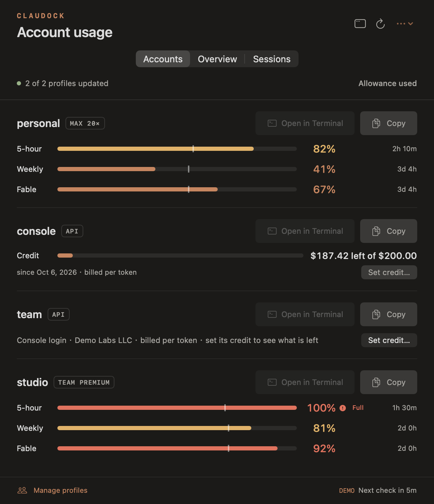
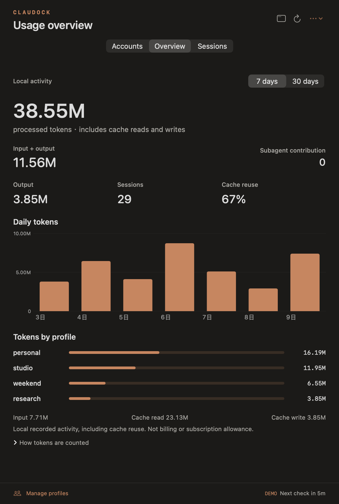

# Claudock user guide

A native Mac menu bar app that puts your Claude Code accounts in one place. Check subscription limits, explore recorded token activity, continue a saved session with another profile, and manage profiles from one app-owned registry. Optional shell integration adds `claudock` and missing `claude-{profile}` shortcuts while preserving the commands you already use.

Built with SwiftUI and AppKit, with no third-party package dependencies. Requires macOS 14 or newer.

Claudock is an independent open-source project, unaffiliated with Anthropic. Live subscription limits use Claude's undocumented OAuth usage endpoint. Availability and response formats can change without notice; this app cannot guarantee continuous access.

<p> </p>

Screenshots use the built-in synthetic demo. No real account data is shown.

Each account row has **Open in Terminal** to start that profile and **Copy** to copy its launch command. Copy displays a visible confirmation; launch failures appear beside the account. Unresolved custom wrappers retain the Copy action until their subscription config is imported.

## Get started

For a packaged build, open **Claudock.app** and move it to **Applications**. No Xcode is needed to run the app. A local or CI build is signed ad hoc and is not notarized; it does not have the Gatekeeper trust of a Developer ID signed, notarized release. Only open a downloaded build from a source you trust, using macOS's standard **Privacy & Security → Open Anyway** flow if needed.

To build from source, install **Xcode 16 or newer**, open Xcode once to finish setup, then double-click **Bootstrap.command**. Or run this from the repository:

```sh
./scripts/bootstrap.sh
```

Bootstrap checks the Mac and Swift toolchain, runs the tests, packages a fresh app under `dist/Build.*/`, and opens it. It does not install dependencies, change your shell configuration, or enable launch at login. A full Xcode installation is needed for the test frameworks; Command Line Tools alone are insufficient. With Xcode in a custom location, set `DEVELOPER_DIR` to that app's `Contents/Developer` directory before running the script.

The setup guide introduces the app, imports existing Claude profiles without executing your shell, detects the Claude executable, and explains menu bar access and email visibility. New users can manage every account through the app; shell integration is optional. Choose **Add an account** to open profile management, or **Open my dashboard** to start monitoring. You can reopen the guide later with **Settings → Show setup guide…**.

Click the menu bar icon to open the usage popover; click elsewhere to close it. For more room, click the window icon in the header or right-click the menu bar icon and choose **Open dashboard**. The dashboard is an ordinary resizable window that you can minimize or close. Closing it keeps the menu bar app running.

Install and sign in to [Claude Code](https://code.claude.com/docs/en/setup) to obtain live account limits. In **Manage profiles**, enter a name and choose **Add profile** to create an account. **Import folder…** lets you use an existing Claude config directory. **Open Claude sign-in after adding** is selected by default. For an existing account, choose **Re-login**, finish authentication in Terminal, and refresh the dashboard. If Claude Code is installed in a custom location, choose **Locate Claude executable…** in Settings.

## Your profiles, together

On first use, Claudock imports the default `claude` account and statically reads zsh functions and aliases named `claude-{profile}`. Later refreshes use its own profile registry. Use **Import zsh profiles** in the app or `claudock profile import-shell` to rescan external declarations. Common declarations import directly:

```zsh
claude-work() {
  CLAUDE_CONFIG_DIR="$HOME/.claude-work" claude "$@"
}

alias claude-personal='CLAUDE_CONFIG_DIR="$HOME/.claude-personal" claude'
```

Discovery reads `.zshenv`, `.zprofile`, and `.zshrc`, following bounded literal `source` paths. It does not execute your shell startup files. Wrappers with dynamically computed paths can need a manual import. The app also recognizes literal `_claude-native` config-directory wrappers. Secret-looking source files are skipped.

The **Accounts** tab shows **5-hour**, overall **Weekly**, and **Fable** allowances in three equally weighted, aligned rows. Percentages represent **used** allowance; the vertical pace tick marks the elapsed fraction of a known 5-hour or 7-day window. A fill past the tick is ahead of elapsed time. Short reset countdowns sit beside each percentage; hover for the full reset date or hover a label for the full window title. Limits at 100% or more include a symbol and **Full**. If several Fable allowances are returned, the most used one occupies the Fable row and the others retain compact meters below. Without a reported Fable allowance, its row shows an empty track, **—**, and **Not reported**. Missing session or overall weekly rows are omitted, and unknown durations or missing reset times have no tick. Accounts refresh sequentially, by default five minutes after a refresh completes. Choose a 1-, 5-, or 15-minute interval in Settings. The app and `claudock usage` share their readings: at launch the dashboard shows the last readings before it asks Claude, and an automatic refresh does not ask again for an account that either of them read within the last half interval. Manual refresh asks again for every account and has a one-minute cooldown. A rate limit (HTTP 429) pauses requests for that account, in the app and in `claudock usage` alike, until the time Claude's `Retry-After` gives, kept between five minutes and a day, or otherwise for one minute, doubling with each further rate limit up to 30 minutes; a manual refresh does not shorten it. Failures retain the last reading with muted meters and a stale indicator.

## Local token activity

The **Overview** tab summarizes recorded activity across profile config folders for **7 days** or **30 days**, including today. The headline shows **processed tokens**, including cache reads and writes. **Input + Output** is shown separately, and **Subagent contribution** identifies the portion already included from recognized subagent logs. It also includes a daily chart, per-profile totals, output tokens, session count, and cache reuse. Hover a profile total for its input, output, cache read, and cache write breakdown.

Recorded tokens are the sum of input, output, cache read, and cache creation counters in local Claude session logs. Reused context counts on each request, so the total is not a count of unique text. Cache reuse is cache-read tokens divided by input plus cache-read plus cache-write tokens. These figures describe local recorded activity; they do not measure account billing or subscription allowance.

The scanner reads main session JSONL files under each profile's `projects` folder, plus direct subagent logs and recognized workflow logs under `<project>/<sessionUUID>/subagents/workflows/wf_*/`. It supports shared or symlinked `projects` roots. New profiles created by Claudock share the default `~/.claude` history. When multiple profiles point to the same history folder, the app scans it once and labels its totals **Shared history**. Claude's local logs do not provide a reliable account identifier, so shared history cannot be split accurately between those accounts.

Per-profile totals are available when history folders are isolated. Duplicate message history across main, subagent, copied, and forked logs is counted once using message identifiers; attribution among isolated copies goes to the oldest local file copy. This is a local attribution heuristic, not proof of which account was originally billed. Deleted logs, other computers, unsupported records, and unrecognized log locations are outside the totals.

History scanning runs in the background with a 120-second and 8 GiB total read budget, up to 50,000 files, 512 MiB per file, and 32 MiB per line, plus directory-entry and message limits. The dashboard shows scanned versus eligible files and the scan time. **Partial local history** means some records were unreadable, invalid, or skipped because of a limit; the total is then incomplete. Matching file counts alone do not guarantee every record was usable. The app keeps summaries in memory and does not upload transcripts or analytics.

## Continue a saved session

In **Sessions**, search by project or profile, choose a 7- or 30-day period, and select **Continue as…** beside a session. Choose the destination under **Continue using**, then select **Continue in Terminal**. The list shows up to the 100 most recent matching sessions from the local scan.

The app opens the original project directory in a new Terminal and starts Claude Code under the chosen profile with `--resume` pointing to the source JSONL file and `--fork-session`. The source file stays in place, and an existing Terminal session is not stopped. The new session uses the target profile's Claude settings and login. Claude Code's normal project trust and tool permission prompts still apply.

This requires Claude Code's support for an absolute JSONL resume path. That argument support was checked against Claude Code **2.1.263**; compatibility with other versions and a successful live account-to-account continuation are separate checks. A missing project directory or unavailable source file prevents launch. If the destination needs authentication, use **Re-login** first.

## Make it yours

Open the **…** menu in the header for Settings. Preferences are saved locally.

- **Show account emails** is optional and off by default.
- **Sort accounts** offers **Profile order**, **Highest usage first**, which brings accounts nearest a limit to the top, and **Most left first**, which brings the accounts with the most room in their tightest 5-hour, Weekly, or Fable limit to the top, then Console profiles by the share of credit left, then full accounts, soonest free first. An earlier **Highest usage first** switch carries over.
- **Group accounts by** splits Accounts into **Account type** sections (Subscriptions, Console API keys, Console sign-ins, Third-party endpoints, Other) or **Usage status** sections (Available, Near limit, Full, Needs attention, Not tracked). Click a section header to collapse it; collapsed sections are remembered, and a search shows its matches in them too.
- With more than four profiles, Accounts shows a filter bar: a search field (⌘F) for a profile name, plan, Console organization, or a shown email; status chips that count and filter the profiles in each usage status; and a **View** menu for account type, grouping, and sort. Filters reset when the app quits.
- **Compact account rows** reduces spacing in Accounts.
- **Refresh interval** offers 1, 5, or 15 minutes; the default is 5.
- **Appearance** offers System, Light, and Dark.
- **Accent** offers Copper, Sage, Iris, and Blue.
- **Launch at login** can be enabled from Settings after placing the app in Applications.
- **Locate Claude executable…** selects a custom Claude installation for actions launched by the app.
- **Require inference token to launch** makes every Claudock launch of a subscription profile use its inference token; without a valid one, the launch stops instead of using the profile's normal login. `claudock require-token on|off|status` changes the same setting.
- Closing the dashboard keeps the menu bar app running. Use Settings or right-click the menu bar icon to quit.

Claudock accepts Claude Pro, Max, Team, and Enterprise subscription profiles, Anthropic Console accounts, through a [pasted API key](#console-api-keys) or [Claude Code's own Console sign-in](#sign-in-to-a-console-account-instead), and [third-party endpoints](#third-party-endpoints) that speak the Anthropic Messages protocol. External-provider wrappers such as Vertex, Bedrock, and Foundry are excluded from import. Legacy cloud registrations are removed from the app without deleting their configuration or shared history.

## Manage profiles

Use **Manage profiles** to add or import accounts, rename them, re-login, and remove them from Claudock. You can use these actions entirely through the app. Adding, renaming, and removing profiles do **not** change `.zshrc`.

Claudock saves names and directory bindings in:

```text
~/Library/Application Support/Claudock/profiles.json
~/Library/Application Support/Claudock/accounts/<stable-id>/claude/
~/Library/Application Support/Claudock/api-credit.json      # Console credit, once set
~/Library/Application Support/Claudock/usage-cache.json     # last quota readings and rate-limit cooldowns
```

New accounts receive a private, stable config directory whose UUID does not depend on the display name. This keeps each account's login separate. The directory links its projects and history, plus common settings, plugins, and skills, to the default `~/.claude` setup. You can keep using the same conversations and preferences across accounts; changes to shared settings affect the profiles linked to them.

Importing an explicit existing folder preserves its paths, credentials, history, and layout without adding these links. Renaming never moves an account directory. Removing a profile only removes its Claudock registration; it preserves Claude conversations, settings, credentials, and original shell wrappers. The default account is protected from rename and removal.

Because removal keeps every credential, `claudock profile remove NAME` and the app's removal notice list the ones that are still in Keychain: Claude Code's login for the profile's folder (`Claude Code-credentials-…`), the API key Claude Code made at a Console sign-in (`Claude Code-…`), an inference token saved in Claudock (`Claudock-inference-…`), a pasted Console API key (`Claudock-apikey-…`), and a third-party endpoint's key (`Claudock-endpointkey-…`). Items that exist are listed; one that Keychain could not be asked about is listed with a note. The app's notice stays until your next action in Manage profiles, so copy what you need first. Each comes with the `security delete-generic-password -s 'SERVICE'` command that deletes it, followed by the profile's config folder, quoted for the shell. Claude Code keeps a folder's login in one item, so deleting it signs out every command of yours that starts Claude with that folder. Claudock only prints these commands. Deleting an item does not revoke its key or token: revoke API keys in the Console, logins and tokens on claude.ai, and an endpoint key with its provider. The README walks through [removing a profile completely](../README.md#remove-a-profile-completely).

When upgrading from Claude Usage, active shell declarations are imported, including the old `~/.config/claude-usage/profiles.zsh` when it is sourced by zsh. Legacy files remain intact; an orphaned old JSON registry with no active wrapper is not automatically imported, so use Import folder for those accounts. Claudock does not rewrite old generated wrappers or remove their source line. Existing external `claude-NAME` wrappers continue to be owned by their original shell configuration; renaming or removing a Claudock entry does not rewrite those commands.

### Optional shell integration

Open **Manage profiles → Enable claudock in zsh** to install the `claudock` command and shortcuts such as `claude-work`. Place the app in its final location first. Enabling creates `~/.config/claudock/init.zsh` and adds only this named loader block to `.zshrc`, with an exact backup before changing an existing shell file:

```zsh
# >>> Claudock shell integration >>>
[[ -r "$HOME/.config/claudock/init.zsh" ]] && source "$HOME/.config/claudock/init.zsh"
# <<< Claudock shell integration <<<
```

**First setup:** open a new Terminal tab to load the integration. It creates missing `claude-NAME` functions for available profiles. Existing aliases, functions, and executables keep their names; `claude` itself is preserved. When a name is already in use, select the account explicitly with `claudock run NAME`.

**After upgrading:** launch the updated app. It upgrades an enabled, unchanged Claudock-owned integration v1–v3 to v4 without turning integration on for users who left it off. Adapter v4 creates only named profile shortcuts. When loaded, it removes a previously generated `claude-auto` function only if its body still matches the definition recorded by Claudock; user replacements remain intact. Upgrade failures appear in Manage profiles. An already-open Terminal still has its old function definitions: open a new tab, or run this once in each existing tab:

```zsh
source ~/.config/claudock/init.zsh
```

**Later profile changes:** once v4 is loaded, shortcuts synchronize when the file is sourced, before each prompt (`precmd`), and before the next entered command (`preexec`). A profile added through the GUI while Terminal is idle is available before you run your next command. Renamed or removed profiles clean up only generated functions whose bodies still match Claudock's recorded definitions; custom edits and other user commands remain intact. These updates change the running shell's functions, not `.zshrc`.

```sh
claudock profile list
claudock profile add work
claudock profile login work
claude-work
claudock profile rename work office
claude-office
claudock run office -- --resume
claudock usage
claudock available --names
claudock profile remove office
claudock profile add console --api-key
claudock profile set-key console
claudock profile set-credit console 200
claudock profile add team --console
```

The namespaced command and generated shortcuts call the CLI bundled inside the app. Shortcuts forward the full profile selector, such as `claude-office`, so similarly named profiles remain distinct. The internal `claudock shell profile-names` helper reads the existing registry and emits selectors as data; it does not discover accounts, create or write the registry, access credentials, or make network requests.

Disabling integration removes Claudock's marked loader block and managed integration files. Open a new Terminal tab afterward to unload its functions and hooks; already-open shells retain what they loaded. Existing user shell declarations remain unchanged.

Import a pre-existing account with `claudock profile add work --directory /absolute/config/folder`. `profile login`, `profile setup-token`, and `run` replace the CLI process with Claude in the **current Terminal and working directory**, using the selected account's config directory and a cleared set of conflicting authentication/provider settings. A Console profile's `run` (API key or Console sign-in) keeps `claudock` running as Claude's parent instead, so it can [count the credit](#track-the-console-credit), and so does `profile login NAME --console` on an API-key profile, which [switches the profile](#sign-in-to-a-console-account-instead) only once the sign-in finishes. A third-party endpoint profile's `run` replaces the CLI process like a subscription's. Additional Claude arguments go after `--` and are forwarded as literal arguments without shell evaluation. The configured Claude executable in Settings applies to both the app and CLI.

`claudock usage` prints tab-separated profile, plan, usage-window, used-percentage, and reset-time columns for each supported profile, and no emails or credentials. A subscription profile's reading comes from a cache shared with the app while it is younger than three minutes, so scripts and terminals that check quota often do not each ask Claude: `--max-age SECONDS` (0 to 86400) sets that age, and `--fresh` asks for a new reading of every profile. A profile that Claude has rate-limited is not asked again until its cooldown ends, even with `--fresh`. While it cools down, or when its request fails, `usage` prints its last reading as usual with one line on stderr, such as `claudock: work: rate limited until 14:05; showing reading from 3 min ago.`, and exits 0; it exits unsuccessfully only when a profile has no reading at all. One Claudock process at a time asks Claude, half a second between requests: a `usage` started meanwhile waits up to 30 seconds and prints what that process reads, or else the cached readings with a note. Console API-key and Console-login profiles have no subscription limits and get no request: with a [credit set](#track-the-console-credit) they print a row of the same shape, `console  Console API  Credit · $187.42 of $200.00 left  6.29  -`, and without one a note on stderr that names `profile set-credit` (for a Console-login profile, with its Console organization). A third-party endpoint profile gets only a note, `claudock: NAME: third-party endpoint (HOST, MODEL), billed per token by the provider; no quota to read.`, and `available` does not list it. This reports subscription allowance and Console credit; use Overview for local token activity. `claudock available` reads the same way and lists only the profiles with usage left, most left first, in profile, kind, plan, left, tightest-limit, and reset columns: a subscription by the room in its tightest 5-hour, Weekly, or Fable limit (a limit past its reset time counts as empty), then Console profiles with credit left. Full profiles are not listed; near-limit ones are. `--names` prints only the names, for scripts, and it exits 1 when no profile has usage left, naming the next to free up. `claudock shell status`, `enable`, and `disable` expose the same optional integration controls. If the app moves, enable integration again from the app's new location to update its executable path.

Without shell integration, all GUI features work and the CLI can still be invoked by its absolute path:

```sh
'/Applications/Claudock.app/Contents/MacOS/claudock' profile list
```

Automatic integration refuses a symlinked `.zshrc` or a detected custom `ZDOTDIR` so it does not modify the wrong startup file. For a dotfile manager or custom shell layout, keep integration off and add this function to your own shell configuration, adjusting the app path to its actual location:

```zsh
function claudock() {
  command '/Applications/Claudock.app/Contents/MacOS/claudock' "$@"
}
```

This minimal manual setup provides only `claudock`. Use `claudock run NAME`, or define your own shortcuts through your dotfile manager.

## Console API keys

A Console API-key profile runs Claude Code with a Claude Console API key instead of a subscription login. Use one to keep working when a subscription reaches its limit. API usage is billed per token by the Console, not by a subscription, and is charged to the key's Console organization.

**Add one.** In **Manage profiles**, choose **Console API key**, enter a profile name, paste the key, and choose **Add profile**. In Terminal, the key is read from standard input, never from command arguments:

```sh
claudock profile add console --api-key              # prompts without showing the key
pbpaste | claudock profile add console --api-key    # or pipe it in
```

Paste the raw key (`sk-ant-api03-…`, `sk-ant-usr-…`, or any other `sk-ant-` key from the Console) or its `export ANTHROPIC_API_KEY=…` line; the input is parsed as data and never executed. A few `sk-ant-` credentials are not API keys and are rejected: subscription OAuth tokens (`sk-ant-oat01-…`) and refresh tokens (`sk-ant-ort01-…`) and Admin API keys (`sk-ant-admin01-…`), because they cannot be used as `ANTHROPIC_API_KEY`, and Claude session credentials (`sk-ant-sid01-…`, `sk-ant-si-…`, `sk-ant-cc-…`, `sk-ant-ccsr-…`), which are not Console API keys. Create an API key in the Claude Console instead. `--directory ABS_PATH` imports an existing config folder, as for other profiles. The key is saved in Keychain before the profile appears; if saving fails, no profile is created.

**Use it.** `claudock run console`, the `claude-console` shortcut, **Open in Terminal**, and **Continue as…** work as they do for subscription profiles. For that launch only, Claudock clears inherited authentication and provider variables, sets `ANTHROPIC_API_KEY` from Keychain, and keeps the profile's config folder; it never adds an inference token. New profiles share session history, so `claudock run console -- --resume` continues a conversation started under a subscription.

The first interactive launch asks whether to use the API key; choose **Yes**. Claude Code saves the answer in the profile's own config folder, so later launches do not ask again. Non-interactive `-p` runs use the key directly.

**Interactive sessions may be refused.** Observed on 2026-10-09 with Claude Code 2.1.295 (not documented by Anthropic): on Console organizations whose credit is a recent grant, headless `-p` runs are accepted while interactive sessions, including **Continue as…**, are refused with `Credit balance too low · Add funds`, though the Console shows credit. Pasted keys and Console sign-ins behave the same. Check the credit's terms in the Console (**Settings → Billing**) or ask Anthropic, and use a subscription profile for interactive work. See [Interactive sessions on Console credit](../README.md#interactive-sessions-on-console-credit) in the README.

**Replace it** with **Replace API key…** in **Manage profiles**, or `claudock profile set-key console`. **Re-login** is not offered for these profiles, and `claudock profile login` refuses them unless you [switch to a Console sign-in](#sign-in-to-a-console-account-instead) with `--console`. The dashboard shows an **API** badge and, once a credit is set, a **Credit** meter instead of limit bars; **Highest usage first** and **Most left first** list these profiles after subscription accounts.

### Sign in to a Console account instead

Claude Code can sign in to an Anthropic Console account itself (`claude auth login --console`, "Use Anthropic Console (API usage billing)"). It then creates an API key for that account and keeps it in Keychain, so there is no key to create, copy, or paste. A Console-login profile uses that sign-in. In **Manage profiles**, choose **Console account (sign in)**, enter a name, and choose **Add profile**; the Console sign-in opens in Terminal and your browser. In Terminal:

```sh
claudock profile add team --console     # adds the profile, then signs it in through the browser
claudock run team
```

`--directory ABS_PATH` imports an existing config folder, as for other profiles. If the sign-in is cancelled or fails, the profile stays; sign it in later with `claudock profile login team`, or **Sign in…** on its row in **Manage profiles**.

**Which to choose.** Sign in when you can open the Console account in a browser on this Mac: Claude Code creates, stores, and uses the key itself, and the dashboard names the account's organization, such as **Console login · Example LLC**. Paste a key when someone gave you one, when the profile must use one particular key, or when you cannot sign in here. Either way usage is billed per token, the [Console credit](#track-the-console-credit) is tracked the same way, and the profile shares your session history. Usage is charged to the Console organization of the sign-in, not to a subscription.

**Use it.** `claudock run team`, the `claude-team` shortcut, **Open in Terminal**, and **Continue as…** start Claude Code with the profile's own sign-in. Claudock clears inherited authentication and provider variables and passes no key or token. If the profile is not signed in, for example after a cancelled sign-in, the launch stops before Claude starts: `team is not signed in to a Console account. Sign in with: claudock profile login team`.

**Switch between them.** `claudock profile login console --console` signs an API-key profile in to its Console account. Once Claude Code finishes and has saved its key, the profile becomes a Console-login profile; if you cancel or the sign-in fails, it keeps using its pasted key. The pasted key stays in Keychain, unused, and the command prints its service name and the `security delete-generic-password` command that deletes it. `claudock profile set-key team` goes the other way: it saves a pasted key and switches the profile to it, and the key Claude Code created at sign-in stays in Keychain, unused; the command prints its service name and how to delete it. To switch back, sign in again with `claudock profile login team --console`. A subscription profile does not switch; add a separate profile for the Console account.

The dashboard shows a Console-login profile like an API-key profile, with an **API** badge, its organization, and a **Credit** meter once a credit is set.

Inference tokens do not apply: `profile setup-token` and `profile set-token` refuse Console-login profiles, and **Require inference token to launch** does not block them. **Remove** keeps Claude Code's sign-in in Keychain, in its `Claude Code-…` item (and any login it kept in `Claude Code-credentials-…`), and the CLI lists each item that exists with the command that deletes it.

### Track the Console credit

Anthropic offers no API for the prepaid credit left on a Console organization, so you enter it yourself. Look up the remaining credit in the Claude Console, then choose **Set credit…** on the profile's dashboard row (or in **Manage profiles**), or run:

```sh
claudock profile set-credit console 187.42
```

The amount is in US dollars, from 0 to 1,000,000, with at most two decimals. Claudock records it with the current time; spend from before that no longer counts. From then on the dashboard row shows a meter of what has been spent, **$187.42 left of $200.00**, and **since** the date you set it, and `claudock usage` prints the same as a row. Below 10% of the credit or below $5 left, the row turns red, shows **LOW CREDIT**, and counts toward the number beside the menu bar icon.

This works the same for API-key and Console-login profiles. Claudock subtracts what Claude Code itself reports for every request in sessions that Claudock starts on this Mac: `claudock run`, the profile's shortcut, **Open in Terminal**, and **Continue as…**. For these launches `claudock` stays running as Claude's parent with a small receiver on `127.0.0.1`, and Claude Code sends it the cost of each request through its OpenTelemetry log export, about once a second: the same figures Claude Code adds up as its own session cost. Each one is saved as it arrives. Ctrl-C, Ctrl-Z, `fg`, and the exit status behave as before. To stop such a run from a script, send SIGTERM, which Claudock passes on, or signal the whole process group: SIGINT or SIGQUIT sent to `claudock`'s process ID alone is ignored, and if `claudock` is killed with SIGKILL, Claude keeps running and the rest of its spend is not counted.

This is an estimate, and the Console balance is authoritative. Use of the same key elsewhere, on other Macs, in scripts, or in other tools, is not seen; neither are Claude Code sessions started without Claudock. Set the credit again from the Console whenever you check it. A few things can make the estimate low: Claude Code runs that are killed outright (`kill -9`) lose the requests of their last second, and settings that change Claude Code's telemetry (an `env` entry for `OTEL_…` or `CLAUDE_CODE_ENABLE_TELEMETRY` in the profile's or project's settings, or managed settings) can send its reports elsewhere; Claudock names such a setting before it starts Claude. When an interactive session ends normally, Claudock also compares Claude Code's own session total in the profile's `.claude.json` and adds any difference.

For these launches Claudock replaces any `OTEL_*` variables in your environment, so your own OpenTelemetry collector does not receive them.

**Remove it** like any profile. Removal keeps the key in Keychain, as Claudock keeps other credentials, and the CLI prints the item's service name with the command that deletes it; the app shows the same in its notice. A profile that once signed in to a Console account lists Claude Code's key as well. To delete the key, run that command:

```sh
security delete-generic-password -s 'Claudock-apikey-…'
```

The key stays valid in the Console until you revoke it there.

Claudock versions before Console API-key support cannot open a profile registry that contains an API-key or Console-login profile, and versions before Console-login support cannot open one that contains a Console-login profile; they report it as invalid rather than turning the profile into a subscription profile. Remove those profiles before going back to such a version.

## Third-party endpoints

A third-party endpoint profile runs Claude Code against another service that speaks the Anthropic Messages protocol, such as DeepSeek at `https://api.deepseek.com/anthropic`, with one model pinned for every request. Usage is billed per token by that provider. Your prompts, the files Claude reads, and tool results go to the provider.

**Add one in Terminal.** The app lists endpoint profiles, opens and copies their launch commands, replaces their key, and removes them, but does not add them. The key is read from standard input, like a Console key: at a terminal Claudock prompts without echoing, otherwise it reads what is piped or redirected in.

```sh
claudock profile add deepseek --endpoint https://api.deepseek.com/anthropic --model deepseek-flash < ~/.config/keys/deepseek.zsh
claudock run deepseek
```

The input is the raw key, or exactly one `export NAME=value` or `NAME=value` line, its value optionally in quotes, as in a shell key file; it is parsed as data, never executed. The key must be printable characters without spaces, at most 512. An Anthropic key (`sk-ant-…`) is refused, because the endpoint's provider would receive it. The URL must be `https` with a host, and no user name, password, query, or fragment; a trailing slash is dropped. The model is one id of letters, digits, and `. _ : / -`, up to 128 characters, optionally ending in `[1m]`. An endpoint profile always gets a config folder of its own, so `--directory` does not apply.

**Use it.** `claudock run deepseek`, the `claude-deepseek` shortcut, **Open in Terminal**, and **Continue as…** start Claude Code with inherited authentication, provider, and model variables cleared, then `ANTHROPIC_BASE_URL` set to the URL, the key as `ANTHROPIC_AUTH_TOKEN` (a bearer token; `ANTHROPIC_API_KEY` would make an interactive Claude Code ask to approve the key), and the model in `ANTHROPIC_MODEL`, `ANTHROPIC_DEFAULT_OPUS_MODEL`, `ANTHROPIC_DEFAULT_SONNET_MODEL`, `ANTHROPIC_DEFAULT_HAIKU_MODEL`, `ANTHROPIC_DEFAULT_FABLE_MODEL`, `ANTHROPIC_SMALL_FAST_MODEL`, and `CLAUDE_CODE_SUBAGENT_MODEL`. `CLAUDE_CODE_DISABLE_NONESSENTIAL_TRAFFIC` and `DISABLE_NON_ESSENTIAL_MODEL_CALLS` are set, and inherited `OTEL_…` and `CLAUDE_CODE_ENABLE_TELEMETRY` settings are dropped. When the model is pinned without `[1m]`, `CLAUDE_CODE_DISABLE_1M_CONTEXT=1` is set too: Claude Code's default model is the Opus one with `[1m]`, and this keeps it the plain pinned id. Claude replaces `claudock` as for a subscription profile; there is no credit to count. A `--model`, `--fallback-model`, or `--advisor` (or its `=` form) that names any other model is refused before anything starts, with exit status 2. **Require inference token to launch** does not apply: the profile uses its own key.

**Pinned for interactive use too.** Each launch passes Claude Code one `--settings` JSON object, which applies to that launch only and is never written to a file. Its `availableModels` lists the pinned model, so `/model` answers another model with "Your organization restricts model selection" and the model picker hides the rest; Claude Code matches it by prefix, so the id without `[1m]` admits both forms. Its `env` repeats the endpoint's URL and model variables, because Claude Code copies each settings file's `env` over its environment and `--settings` outranks your user, project, and local settings: a repository's `.claude/settings.json` cannot point the session at another host or model. It also leaves empty every other credential, provider, and model variable that launches clear, Claude Code's other model-choosing variables (`ANTHROPIC_DEFAULT_MODEL`, `CLAUDE_CODE_AUTO_MODE_MODEL`, `CLAUDE_CODE_BG_CLASSIFIER_MODEL`, `CLAUDE_CODE_WORKFLOW_SUBAGENT_MODEL`, `ANTHROPIC_CUSTOM_MODEL_OPTION…`), `CLAUDE_CODE_USE_GATEWAY`, and `apiKeyHelper`: a settings file cannot add an Anthropic key (as `ANTHROPIC_API_KEY` or a key helper's output) or headers to the endpoint's requests, switch the provider, or choose another model for a role; the launch removes those variables from the inherited environment too. The key itself cannot be in arguments, so a launch stops with exit status 2 when the working directory's `.claude/settings.json` or `.claude/settings.local.json`, or managed settings, set `ANTHROPIC_AUTH_TOKEN`, which Claude Code would send to the endpoint instead. A `--settings` of your own, JSON or a file path, is merged into this object; one that sets `model`, `availableModels`, `fallbackModel`, `advisorModel`, `modelOverrides`, `modelPicker`, or `apiKeyHelper` to anything else, or an `env` credential, provider, or model variable, is refused, as is `--settings` given twice (Claude Code would keep only the last). Limits: `availableModels` from a project's or your own settings is added to the list rather than replaced, so a repository could allow another model; and `/model` saves a choice made with Enter in the settings all profiles share, so in an endpoint session press `s` to keep a choice for the session only.

**Map the model.** Claude Code 2.1.296 does not know third-party models: it warns `"MODEL" isn't described by this version's model catalog…` and keeps the session under 200k tokens before compacting. `--behaves-as CATALOG_MODEL` on `profile add` or `profile set-endpoint` adds a single row to that `--settings` object's model picker (`modelPicker`, replacing the built-in rows) whose `behavesAs` maps the pinned model to that catalog model: Claude Code then uses its prompt, output limit, and context window (200k for `claude-sonnet-4-6`, 1M for `claude-opus-4-8`), and the warning goes. It applies however the model is chosen, `ANTHROPIC_MODEL` included, and changes neither the name shown nor the model sent. Only full catalog ids work; `--behaves-as none` removes it. Pinning `deepseek-flash[1m]` instead makes Claude Code assume a 1M window and send Anthropic's 1M context header (`context-1m-2025-08-07`) with the plain id; it compacts only when the endpoint refuses a request.

**Resuming a conversation.** Profiles share session history, and a long conversation made with Claude can fail on the endpoint (DeepSeek refused a compaction with `API Error: 422 … unknown variant tool_definition`). Before an endpoint launch, Claudock works out which session `--continue` or `--resume` would load, the way Claude Code 2.1.296 does: the folder named after the working directory's real path (or `CLAUDE_CODE_PROJECT_DIR_NAME`), the newest session there that `--continue` does not pass over, a session ID found in that folder or else in any project folder, a title, or a `.jsonl` path. It reads only which model answered each reply (`message.model`) and which one Claude Code asked for (`requestedModel`) in that transcript and its subagent transcripts; a reply counts as the pinned model's when either is the pinned id with or without `[1m]`, since the endpoint answers a `[1m]` request as the plain model. If another model replied, the launch stops with exit status 2 and names the models; `claudock run NAME --allow-cross-provider-resume -- …` resumes anyway. The picker (`--resume` without a value), a remote session, and `--from-pr` cannot be checked first: the launch goes ahead with a one-line warning. **Continue as…** into an endpoint profile is checked the same way, and a refusal shows in its Terminal window.

**Change it.** `claudock profile set-endpoint deepseek --endpoint URL` or `--model MODEL` changes the endpoint or the model and keeps the key; without options it shows them. `claudock profile set-key deepseek` replaces the key, read like the first one. **Replace key…** in **Manage profiles** does the same.

**What does not apply.** These profiles have no Claude sign-in, inference token, Console credit, or subscription limits: `profile login`, `profile setup-token`, `profile set-token`, `profile clear-token`, and `profile set-credit` refuse them with one line each. The dashboard row reads `Third-party endpoint · HOST · MODEL`, billed per token by the provider, with no meters; the account type filter and grouping have a **Third-party endpoints** entry. `claudock usage` and `claudock available` print a note instead of a row and exit as they would without the profile.

**First launch.** A new profile folder shows Claude Code's first-run screens on the first interactive launch. Trust the folder if it is yours. If Claude Code asks **Make auto mode your default permission mode?**, choose **No, keep …**: the answer would be written to the settings all profiles share through their links to `~/.claude`.

**Remove it** like any profile. The key stays in Keychain under `Claudock-endpointkey-…`, and the removal lists it with the command that deletes it. Revoke the key with its provider to stop it working.

Claudock versions up to 1.7.0 cannot open a registry that contains an endpoint profile (it is written as version 3); they report it as invalid rather than dropping the profile. Remove endpoint profiles before going back to such a version.

## Privacy and permissions

The app reads each profile's existing Claude OAuth credentials from the corresponding macOS Keychain item, with Claude's `.credentials.json` fallback only when that item is absent. Access tokens are sent to `https://api.anthropic.com/api/oauth/usage`. The last quota reading of each subscription profile (plan, percentages, reset times, and when it was read) and any rate-limit cooldown are kept in `~/Library/Application Support/Claudock/usage-cache.json`, readable only by you, under the profile's Claude credential service name; it holds no tokens or emails. When an access token expires or that endpoint returns HTTP 401, Claudock uses the saved refresh token at `https://platform.claude.com/v1/oauth/token` and updates the same existing credential store. Both HTTP clients reject redirects and use ephemeral sessions without cookies or caches.

Third-party endpoint keys live in their own Keychain items, named `Claudock-endpointkey-` followed by a hash, and reach Claude Code only in its launch environment as `ANTHROPIC_AUTH_TOKEN`; Claude Code sends them, with your requests, to the endpoint you configured. Console API keys live in their own Keychain items, named `Claudock-apikey-` followed by a hash. Claudock reads one only to launch its profile and passes it to Claude Code through that process's environment; it never sends the key anywhere itself. For a Console-login profile, Claude Code keeps its own key in its `Claude Code-…` item: Claudock only checks that the item exists, from its attributes, and never reads it. It reads the Console organization's name from the profile's `.claude.json` to show it.

For a Console API-key or Console-login launch, Claudock turns on Claude Code's OpenTelemetry log export and points it at a receiver inside `claudock`, on `127.0.0.1` at a random port and path; the reports never leave the Mac. Claudock keeps only each request's cost, model, session ID, and time, in `~/Library/Application Support/Claudock/api-credit.json` (readable only by you), never keys, prompts, or responses.

There is no analytics service, telemetry, or developer-operated backend. Automatic renewal coordinates with Claude Code's credential locks, preserves unrelated fields, and stores replacement refresh tokens returned by Anthropic. It does not renew on quota HTTP 403, 429, or network failures. When the refresh token is missing, expired, or rejected, re-login delegates to Claude Code in Terminal through a temporary local command file that deletes itself when it runs. macOS may request Keychain access. Profile configuration contains local paths and names; keep it out of public issues and repositories. See [SECURITY.md](../SECURITY.md) for reporting guidance.

## Troubleshooting

| Message or symptom | What to do |
| --- | --- |
| Profile is missing | Rescan shell profiles, or import its config folder in Manage profiles. Shell import needs a `claude-NAME` wrapper with a literal path. |
| Config directory cannot be resolved | Replace a computed path with a literal `CLAUDE_CONFIG_DIR`, or import the profile. |
| This login cannot be renewed | Choose Re-login, finish Claude Code authentication in Terminal, then refresh. |
| Credential update is busy | Retry after a minute or open the profile in Claude Code. Claudock does not steal existing or stale lock directories. |
| Another profile update is in progress | Another Claudock process held the profile registry for more than five seconds, for example while adding a profile. Try again. Parallel launches share the registry and do not cause this. |
| Could not update saved credentials | Unlock Keychain and retry. Claudock retains a successful renewal in memory while retrying its save; closing the app loses that unsaved result. |
| The last renewal could not be confirmed | Open the profile in Claude Code or re-login. Claudock will use the updated credential; it will not resend a potentially consumed refresh token. |
| This credential cannot read usage | Check the account and credential permissions in Claude Code. This error does not trigger token renewal. |
| Keychain access unavailable | Unlock the Mac, respond to any Keychain access prompt, then retry. |
| HTTP 429 / cooldown | Wait for the displayed retry time. Repeated refreshes and `claudock usage --fresh` will not bypass it; the app and `claudock usage` share it. |
| `rate limited until HH:MM; showing reading from N min ago` | `claudock usage` printed that profile's last reading because Claude rate-limited it, and exited 0. It asks again after the cooldown. |
| `another Claudock process is reading usage` | Another `claudock usage` or the app held the shared fetch lock for more than 30 seconds, so the cached reading was printed. Try again in a moment. |
| Unrecognized usage response | The upstream endpoint may have changed. Report the app version and message; do not attach credentials or raw responses. |
| `claudock` is unavailable | Enable **Manage profiles → Enable claudock in zsh**, then open a new Terminal tab. If the app moved, enable integration again from its new location. |
| Profile exists in the app, but `claude-work5` is not defined | Confirm integration is enabled. After upgrading, launch the new app and open a new tab or run `source ~/.config/claudock/init.zsh` once. Then try `claude-work5`; `claudock run work5` also works. |
| A shortcut runs my original wrapper or executable | Existing commands take priority. Use `claudock run NAME` to select the Claudock profile explicitly. |
| Token totals look larger than expected | Totals include cache reads/writes and count context reused on separate requests. They are not unique tokens, billed cost, or quota. |
| Partial history | The bounded local scan skipped data. Select 7 days for a smaller window; totals remain a partial view. |
| Tokens appear under Shared history | New profiles share the default Claude history. Profiles with the same resolved `projects` folder contribute one set of logs; account attribution is unavailable. |
| Continue as… is unavailable | The saved log has no usable project path. A project folder must exist to continue there. |
| Claude rejects a resume file | Confirm your Claude version supports absolute JSONL paths with `--resume`; the app's compatibility check used 2.1.263. |
| No Console API key is saved | Save one with **Replace API key…** in Manage profiles or `claudock profile set-key NAME`. |
| NAME is not signed in to a Console account | The Console sign-in was cancelled, failed, or was removed. Sign in with `claudock profile login NAME` or **Sign in…** in Manage profiles. |
| `The Console sign-in did not finish; NAME still uses its Console API key` | Nothing changed. Run `claudock profile login NAME --console` again and finish the sign-in in the browser. |
| Claude asks whether to use an API key | Choose Yes. Claude Code remembers the answer for that profile. |
| `NAME is pinned to the model MODEL; --model can name only that model.` | An endpoint profile serves one model. Leave `--model` and `--fallback-model` out, or pin another model with `claudock profile set-endpoint NAME --model MODEL`. |
| `No endpoint key is saved for 'NAME'.` | Save the provider's key with `claudock profile set-key NAME`, or **Replace key…** in Manage profiles. |
| `This is an Anthropic key (sk-ant-…).` when adding an endpoint key | Claudock never hands an Anthropic credential to a third party. Use the key the endpoint's provider issued. |
| `NAME runs on HOST, but the session … has replies from …` | The conversation was made with other models and can fail on the endpoint. Start a new session, or run `claudock run NAME --allow-cross-provider-resume -- …`. |
| `NAME: --settings sets …, which this endpoint profile pins.` | Your `--settings` chooses a model, an endpoint, or a credential. Remove that setting; Claudock passes the pinned ones itself. |
| `NAME: FILE sets ANTHROPIC_AUTH_TOKEN, which Claude Code would send to HOST instead of the endpoint key.` | A project or managed settings file carries its own token for Claude Code. Remove that `env` entry, or start the endpoint profile in another folder. |
| `"MODEL" isn't described by this version's model catalog` | Claude Code does not know the endpoint's model. Map it with `claudock profile set-endpoint NAME --behaves-as claude-sonnet-4-6`, or pin the model with `[1m]`. |
| Claude sessions ask Anthropic for the endpoint's model | `/model` in an endpoint session saved it in the shared `~/.claude/settings.json`. Remove its `"model"` entry; next time press `s` in `/model`. |
| The credit left differs from the Console | The estimate counts only Claude Code sessions Claudock starts on this Mac. Set the credit again from the Console balance: `claudock profile set-credit NAME AMOUNT` or **Set credit…**. |
| `… sets OTEL_… for Claude Code, which can send its usage events elsewhere` | A settings file gives Claude Code its own telemetry settings, which override Claudock's. Remove that `env` entry for Console profiles, or set the credit again later. |
| `usage events from this run could not be saved` | The credit ledger was busy or unreadable. Set the credit again from the Console balance. |
| `No inference token is saved for 'NAME'.` | `claudock profile clear-token NAME` found nothing to delete: no token is saved for that profile, and `claudock profile tokens` shows `none`. |
| NAME's saved inference token belongs to a different account than its current Claude login | The profile was signed in to another account after its token was saved. Run `claudock profile login NAME` with the token's account, or make a new token: `claudock profile setup-token NAME`, then `pbpaste \| claudock profile set-token NAME`. |
| Launch at login needs approval | Check System Settings → General → Login Items & Extensions. |

## Development and builds

```sh
xcrun swift test
python3 Tests/CLIIntegration/check.py
./scripts/build-app.sh
open 'dist/Claudock.app'
```

`build-app.sh` accepts an output directory and refuses to overwrite an existing `Claudock.app`. It builds both `ClaudockApp` and `claudock`, stages them inside the app under `.build/`, generates an AppKit vector icon, validates the plist, signs the bundled CLI before signing the app, and verifies both signatures. The package uses Swift tools 6.0 and Swift 5 language mode. The GitHub Actions workflow tests and packages on macOS 15 and retains an app ZIP as a build artifact. CI does not publish releases.

Build and prepare releases outside cloud-synced folders. Some file providers attach Finder metadata to `.app` bundles after a build, causing a later signature check to fail even when packaging passed. The build removes disallowed metadata from its new bundle before signing and checks the final path, but cannot prevent subsequent changes by other software. Apple's [code-signing guidance](https://developer.apple.com/library/archive/qa/qa1940/_index.html) explains this error.

The build targets the machine's architecture. Build on Apple Silicon for arm64 and on Intel for x86_64; the current script does not produce a universal binary. Intel support has not been verified. A passing build on one architecture is not verification on the other. See [CONTRIBUTING.md](../CONTRIBUTING.md), [docs/ARCHITECTURE.md](ARCHITECTURE.md), and the [release checklist](RELEASING.md).

### Synthetic preview

Use demo mode to explore the interface or capture screenshots with synthetic data:

```sh
'dist/Claudock.app/Contents/MacOS/ClaudockApp' --demo
```

Demo mode opens an ordinary dashboard window with a **DEMO** indicator. It skips real account discovery, credential access, local-history scanning, and usage network requests. Profile changes, sign-in, and session continuation are disabled. Appearance preferences still use the app's local settings. Quit the preview and open the app normally to monitor your accounts from the menu bar.

### Read-only local analytics diagnostics

To print local token categories and scan coverage without opening the UI, reading credentials, or requesting live quota:

```sh
'dist/Claudock.app/Contents/MacOS/ClaudockApp' --analytics
```

For a fixed upper timestamp, use `--through` with an ISO 8601 value. This example captures the current UTC time before scanning:

```sh
SCAN_CUTOFF=$(date -u '+%Y-%m-%dT%H:%M:%SZ')
'dist/Claudock.app/Contents/MacOS/ClaudockApp' --analytics --through "$SCAN_CUTOFF"
```

The diagnostic uses the current seven-calendar-day window; `--through` changes its upper cutoff, not the start date. It prints totals, input/output/cache counters, per-profile or shared-history totals, scanned/eligible files, bytes, and a partial flag. It does not modify logs or freeze files being written by Claude. Output can reveal profile names and activity; redact it before sharing.

For a distributable release, use your own Apple Developer ID Application identity:

```sh
CODE_SIGN_IDENTITY='Developer ID Application: Your Name (TEAMID)' ./scripts/build-app.sh dist/signed
ditto -c -k --sequesterRsrc --keepParent 'dist/signed/Claudock.app' dist/Claudock-submission.zip
xcrun notarytool submit dist/Claudock-submission.zip --keychain-profile ClaudockNotary --wait
xcrun stapler staple 'dist/signed/Claudock.app'
xcrun stapler validate 'dist/signed/Claudock.app'
spctl --assess --type execute --verbose=2 'dist/signed/Claudock.app'
ditto -c -k --sequesterRsrc --keepParent 'dist/signed/Claudock.app' dist/Claudock-release.zip
```

These commands assume you have configured a `ClaudockNotary` Keychain profile with Apple's `notarytool store-credentials`. Signing enables the hardened runtime. Check that notarization reports **Accepted** before stapling or distributing. The Claudock migration intentionally retains the previous `io.github.claudeusage.ClaudeUsage` bundle identifier to preserve preferences and login-item identity. A new fork should choose its own identifier before its first release and keep GUI/CLI preference domains consistent. No signing credentials or notarization service setup are included in this repository.

## License

[MIT](../LICENSE). Claude and Claude Code are trademarks of their respective owner.

Automatic token renewal runs in the resident menu bar app. The one-shot `claudock usage` command reads quota without rotating credentials; an expired-token message directs you to Claudock or the relevant Claude profile.

## Long-lived inference tokens

Open **Manage profiles → Set token…** (or **Manage token…** for an existing token). **Paste token** is selected by default. Paste a raw `sk-ant-oat01-…` token or its `export CLAUDE_CODE_OAUTH_TOKEN=…` assignment and choose **Save to Keychain**. The input is parsed as data, never executed. Import does not require a browser or a prior normal Claude login. When a token is saved, or its status cannot be read, **Delete token** in the same sheet deletes it from Keychain after you confirm; the row's status refreshes when the sheet closes.

Pasted tokens are assigned manually to the selected profile. Their provider account identity cannot be verified from the opaque value; expiry is shown as unknown unless supplied. Use the matching account's token when pairing it with a quota-monitoring login.

The **Create in browser** option remains available for new tokens. It opens Claude authorization and accepts the returned `code#state` in its own field. That flow verifies account/organization against the profile's existing login and uses the expiry reported by Claude, requesting one year by default.

From Terminal, `claudock profile set-token NAME` saves a token the same way. It reads the token from standard input, with a prompt that hides input at a terminal or from piped input, and never from command arguments. Add `--expires ISO8601_DATE` when you know the expiry. To create a token for a profile, run Claude Code's own `setup-token` command under it. It signs in through your browser, so make sure the browser is signed in to the matching claude.ai account:

```sh
claudock profile setup-token work
pbpaste | claudock profile set-token work
claudock profile tokens
claudock profile clear-token work
```

`claudock profile setup-token work` takes no other arguments and never reads the saved token, so it works whatever that token's state. `claudock run work -- setup-token` also works while `setup-token` is the first Claude argument; if a shell function of yours puts flags before it, use `profile setup-token`.

`claudock profile tokens` lists each profile's token status and expiry in UTC, never the token: `none`, `active`, `expired`, `pasted-unverified`, `n/a` for Console API-key, Console-login, and unresolved profiles, or `unavailable` when Keychain cannot be read. A last line on stderr shows whether tokens are required. When a pasted token has expired, `claudock run` stops and tells you to make a new one with `profile setup-token`.

`claudock profile clear-token work` deletes the token Claudock saved for the profile from Keychain and prints what it deleted. It touches only that item (`Claudock-inference-…`): Claude Code's own login and key stay, and it never reads the token. It exits with status 1 and says so when no token is saved, and, like `set-token`, it refuses Console API-key, Console-login, and unresolved profiles. Afterwards `claudock profile tokens` shows `none`, and a launch uses the profile's normal login, or, with **Require inference token to launch** on, stops with instructions to save a new token. Deleting does not revoke the token at Anthropic.

A saved token remembers the account the profile was signed in to when it was saved. If the login later moves to another account, `claudock run` and the app's launches stop and say so (with the requirement below on, they report an invalid token instead): sign in again with the token's account (`claudock profile login work`), or make a new token as above.

Without a token, or after a browser-created token expires, a launch uses the profile's normal Claude Code login. To rule that out, turn on **Require inference token to launch** in Settings, or run `claudock require-token on`. Then `claudock run`, managed shortcuts, **Open in Terminal**, and **Continue as…** stop with instructions whenever a subscription profile's token is missing, expired, or unreadable. `claudock profile login`, `claudock profile setup-token`, and `claudock run NAME -- setup-token` always work, even after a saved token expires or belongs to another account, so you can create a replacement, and Console API-key and Console-login profiles keep using their key or sign-in. The setting is off by default; `claudock require-token status` prints `on` or `off`.

Saved tokens are preferred by GUI launches, managed shortcuts, and `claudock run`. They survive renames. Imported user-authored wrappers retain their previous authentication; use the copied Claudock command for those profiles. Removing a profile preserves token data and does not revoke it remotely; `profile remove` lists the token's Keychain item with the command that deletes it, and `profile clear-token` deletes it while keeping the profile.

Quota monitoring still uses normal OAuth. A monitoring re-login warning does not mean an independently saved inference token has expired. Revoked or expired tokens need replacement; an unknown expiry is not a promise of unlimited validity.

## Account plan badges

Claudock reads `subscriptionType` and `rateLimitTier`, using the mappings verified in Claude Code 2.1.270. Max 5×, Max 20×, and Team Premium display distinct badges. Missing or unrecognized Max/Team subtypes remain **tier unknown**. A lower quota or an unfamiliar Team rate is not enough evidence to call a seat Standard.
